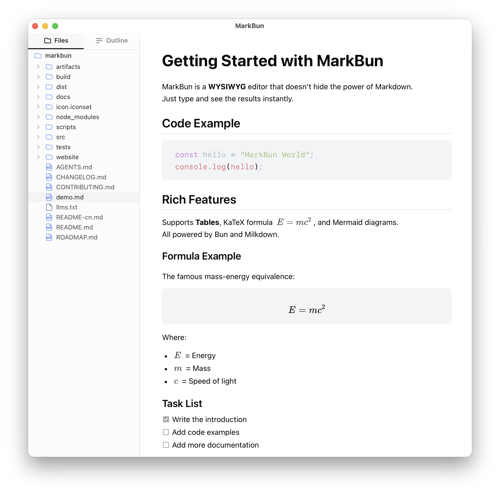
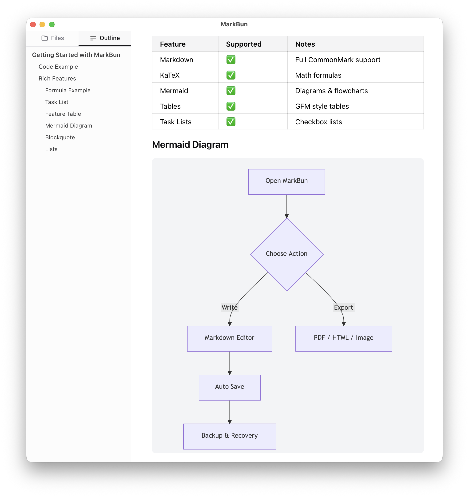

# MarkBun

**[English](README.md)** | 中文

> 📝 快速、美观、类似 Typora 的 Markdown 桌面编辑器

[](LICENSE)
[](https://milkdown.dev)
[](https://electrobun.dev)

MarkBun 是一款开源、跨平台的 Markdown 编辑器，专为流畅写作而设计。与 Typora 类似，它提供无干扰的所见即所得编辑体验——Markdown 语法在输入后自动隐藏，呈现精美的格式化内容。

<div align="center">
  
</div>

**Mark**（来自 Markdown）+ **Bun**（来自 Electrobun）= MarkBun

> 🍞 **MarkBun 这个名字怎么来的？**
>
> **Mark**（Markdown）+ **Bun**（Electrobun）= MarkBun
>
> AI 时代，Markdown 是数字世界的普通话——人人都在用，到哪都吃得开。
> 学会 Markdown，端稳这碗饭——毕竟 Bun 本身就是面包嘛。
> （而且 "Markbun" 听起来确实比 "明文小面包" 香多了）

## 🚧 开发状态

> **⚠️ 早期开发阶段**
>
> MarkBun 目前处于活跃开发中。
>
> **当前状态：**
> - ✅ Electrobun 桌面框架配置
> - ✅ React + Vite + Tailwind CSS 搭建
> - ✅ 支持 HMR 的开发环境
> - ✅ Milkdown 所见即所得编辑器集成
> - ✅ 文件操作（新建、打开、保存、另存为）
> - ✅ 深色模式支持
> - ✅ 工具栏和状态栏（默认隐藏）
> - ✅ 文件浏览器侧边栏 (v0.2.0)
> - ✅ 大纲导航 (v0.2.0)
> - ✅ 快速打开 (Ctrl/Cmd+P)
> - ✅ 自动保存 (v0.3.0)
> - ✅ 设置界面 (v0.3.0)
> - ✅ 多显示器支持 (v0.3.0)
> - ✅ 三层文件保护 (v0.4.0)
> - ✅ 导出为 PNG/HTML (v0.4.0)
> - ✅ 数学公式 (v0.4.0)
> - ✅ 查找与替换 (v0.5.0)
> - ✅ 命令面板 (v0.5.0)
> - ✅ 会话持久化 (v0.5.0)
> - ✅ Windows 支持 (v0.5.0)
> - ✅ AI 聊天助手 (v0.6.0)
>
> 详见 [ROADMAP.md](./ROADMAP.md) 了解详细的开发阶段。

## ✨ 功能特性

### 设计理念

MarkBun 遵循**无界面编辑理念**，灵感来自 [iA Writer](https://ia.net/writer) 和 [Typora](https://typora.io) 的开创性工作。界面刻意保持极简——所有工具栏、标题栏和状态栏默认隐藏，消除视觉干扰，让你专注于内容。

需要时，每个 UI 元素都可以通过**视图菜单**或键盘快捷键即时切换。这种方式将文字置于体验的核心，而非应用界面。

### 核心功能

- 🎯 **流畅的所见即所得编辑** - 自然地书写 Markdown，无干扰
- ⚡ **极速启动** - 基于 Bun 和原生 WebView 构建，启动时间 <50ms
- 🎨 **精美排版** - 精心设计的主题和样式
- 🖼️ **无界面设计** - 默认隐藏所有 UI 元素，沉浸式写作
- 🌙 **深色模式** - 夜间写作护眼
- 📁 **文件管理** - 内置文件浏览器，支持文件夹
- 🔍 **大纲导航** - 快速跳转到任意标题
- ⚡ **快速打开** - 通过 Ctrl/Cmd+P 模糊查找文件
- 🧮 **数学公式** - LaTeX 公式实时预览
- 📊 **表格** - 直观的表格编辑，支持标题样式
- 💾 **自动保存** - 混合节流/防抖策略
- ⚙️ **设置** - 持久化设置，支持 UI 配置
- 🖥️ **多显示器** - 窗口位置按显示器保存，智能回退
- 🛡️ **文件保护** - 原子写入、崩溃恢复和版本历史
- 📤 **导出** - 导出为 PNG 和 HTML
- 🔍 **查找与替换** - 支持高亮搜索，覆盖所见即所得和代码块（`Cmd/Ctrl + F`）
- 🎛️ **命令面板** - 统一命令面板，支持模糊搜索和历史记录（`Cmd/Ctrl + P`）
- 💾 **会话恢复** - 光标位置和滚动状态在会话间保存
- 🪟 **Windows 支持** - 原生菜单栏、图标和 CI 支持
- ⌨️ **键盘快捷键** - 全面的格式化和导航快捷键
- 🔤 **源码模式** - 在所见即所得和源码编辑之间切换（`Cmd/Ctrl + /`）
- 🤖 **AI 助手** - 多供应商 AI 聊天，支持文档编辑工具（OpenAI、Anthropic、Ollama 等）
- 🌐 **国际化** - 多语言支持（英文、中文、日文、韩文等）






## 🚀 快速开始

### 前置条件

- [Bun](https://bun.sh) 1.0+
- macOS 11+、Windows 10+ 或 Linux

### 安装

```bash
# 安装依赖
bun install

# 开发模式（无 HMR，使用打包资源）
bun run dev

# 开发模式（带 HMR，推荐）
bun run dev:hmr
```

### macOS 注意事项

MarkBun 尚未进行代码签名，macOS Gatekeeper 可能会提示"已损坏，无法打开"。安装后请在终端执行：

```bash
xattr -cr /Applications/MarkBun.app
```

### 构建

```bash
# 构建 canary 版本
bun run build:canary

# 构建 stable 版本
bun run build:stable
```

## HMR 工作原理

运行 `bun run dev:hmr` 时：

1. **Vite 开发服务器** 在 `http://localhost:5173` 启动并启用 HMR
2. **Electrobun** 启动并检测运行中的 Vite 服务器
3. 应用从 Vite 开发服务器加载，而非打包资源
4. React 组件的变更即时生效，无需整页刷新

运行 `bun run dev`（无 HMR）时：

1. Electrobun 以文件监听模式启动，从 `views://mainview/index.html` 加载
2. 需要重新构建（`bun run build:canary`）才能看到变更

## 🏗️ 技术栈

| 技术 | 用途 |
|------|------|
| [Milkdown](https://milkdown.dev) | 所见即所得 Markdown 编辑器核心 |
| [Electrobun](https://electrobun.dev) | 跨平台桌面框架 |
| [CodeMirror](https://codemirror.net) | 源码模式编辑器 |
| [Bun](https://bun.sh) | JavaScript 运行时和打包器 |
| [TypeScript](https://typescriptlang.org) | 类型安全开发 |
| [Tailwind CSS](https://tailwindcss.com) | 原子化 CSS |
| [Zod](https://zod.dev) | 设置 Schema 验证 |
| [i18next](https://www.i18next.com) | 国际化 |

## 📁 项目结构

```
markbun/
├── src/
│   ├── bun/                  # 主进程（Electrobun/Bun）
│   │   ├── index.ts          # 主入口和 RPC 处理器
│   │   ├── menu.ts           # 应用菜单
│   │   ├── services/         # 后端服务（设置、备份、UI 状态）
│   │   └── ipc/              # IPC 处理器
│   │
│   ├── mainview/             # 渲染进程（WebView）
│   │   ├── components/       # React 组件
│   │   │   ├── editor/       # Milkdown/Crepe 编辑器封装
│   │   │   ├── file-explorer/# 文件浏览器侧边栏
│   │   │   ├── layout/       # 工具栏、状态栏、标题栏、侧边栏
│   │   │   ├── outline/      # 大纲导航
│   │   │   ├── quick-open/   # 快速打开对话框
│   │   │   ├── settings/     # 设置对话框
│   │   │   └── recovery-dialog/ # 崩溃恢复对话框
│   │   │
│   │   ├── hooks/            # 自定义 React Hooks
│   │   ├── lib/              # 工具函数和辅助模块
│   │   ├── i18n/             # 国际化（8 种语言）
│   │   ├── styles/           # 全局样式
│   │   ├── main.tsx          # React 入口
│   │   ├── App.tsx           # 主应用组件
│   │   └── index.html        # HTML 入口
│   │
│   └── shared/               # 共享类型、设置 Schema 和工具函数
│
├── docs/                     # 文档
│   └── architecture.md       # 架构概述
│
├── electrobun.config.ts      # Electrobun 配置
├── vite.config.ts            # Vite 配置
├── tailwind.config.js        # Tailwind 配置
├── package.json
└── README.md
```

## 🎮 使用方法

### 基本编辑

1. **新建文件**：`Cmd/Ctrl + N`
2. **打开文件**：`Cmd/Ctrl + O`
3. **保存**：`Cmd/Ctrl + S`
4. **另存为**：`Cmd/Ctrl + Shift + S`

### 界面控制

MarkBun 采用**无界面设计**——所有工具栏和 UI 元素默认隐藏，实现无干扰写作。通过**视图菜单**或快捷键切换 UI 元素：

| UI 元素 | 菜单命令 | 默认状态 |
|---------|----------|---------|
| 标题栏 | `视图 → 显示标题栏` | 隐藏 |
| 工具栏 | `视图 → 显示工具栏` | 隐藏 |
| 状态栏 | `视图 → 显示状态栏` | 隐藏 |
| 侧边栏 | `视图 → 显示侧边栏` | 隐藏（`Cmd/Ctrl + Shift + B`） |
| 深色模式 | `视图 → 切换深色模式` | `Cmd/Ctrl + Shift + D` |
| 源码模式 | `视图 → 切换源码模式` | `Cmd/Ctrl + /` |
| 设置 | `MarkBun → 偏好设置` | `Cmd/Ctrl + ,` |

### 格式化快捷键

| 操作 | 快捷键 |
|------|--------|
| 加粗 | `Cmd/Ctrl + B` |
| 斜体 | `Cmd/Ctrl + I` |
| 行内代码 | `Cmd/Ctrl + Shift + C` |
| 删除线 | `Cmd/Ctrl + Shift + ~` |
| 高亮 | `Cmd/Ctrl + Shift + H` |
| 行内公式 | `Ctrl + M` |
| 链接 | `Cmd/Ctrl + K` |
| 图片 | `Cmd/Ctrl + Shift + I` |

### 段落快捷键

| 操作 | 快捷键 |
|------|--------|
| 标题 1-6 | `Cmd/Ctrl + 1/2/3/4/5/6` |
| 正文 | `Cmd/Ctrl + 0` |
| 提升标题级别 | `Cmd/Ctrl + =` |
| 降低标题级别 | `Cmd/Ctrl + -` |
| 无序列表 | `Alt + Cmd/Ctrl + U` |
| 有序列表 | `Alt + Cmd/Ctrl + O` |
| 任务列表 | `Alt + Cmd/Ctrl + X` |
| 引用 | `Alt + Cmd/Ctrl + Q` |
| 代码块 | `Alt + Cmd/Ctrl + C` |
| 公式块 | `Alt + Cmd/Ctrl + B` |
| 分隔线 | `Alt + Cmd/Ctrl + -` |
| 表格 | `Alt + Cmd/Ctrl + T` |

## 🎨 自定义

### 设置

设置存储在 `~/.config/markbun/settings.json`：

```json
{
  "__version": 1,
  "general": {
    "autoSave": true,
    "autoSaveInterval": 2000,
    "language": "en"
  },
  "editor": {
    "fontSize": 15,
    "lineHeight": 1.65
  },
  "appearance": {
    "theme": "system",
    "sidebarWidth": 280
  },
  "backup": {
    "enabled": true,
    "maxVersions": 20,
    "retentionDays": 30,
    "recoveryInterval": 30000
  }
}
```

UI 状态单独存储在 `~/.config/markbun/ui-state.json`：

```json
{
  "showTitleBar": false,
  "showToolBar": false,
  "showStatusBar": false,
  "showSidebar": false,
  "sidebarWidth": 280,
  "sidebarActiveTab": "files",
  "windowX": 200,
  "windowY": 200,
  "windowWidth": 1200,
  "windowHeight": 800
}
```

窗口位置和大小会在重启时自动保存和恢复。如果保存的位置超出可见屏幕区域（例如断开显示器时），窗口将重置到主显示器上的安全默认位置。

### 多显示器支持

MarkBun 完全支持多显示器设置：
- 窗口位置按显示器保存
- 自动检测显示器断开
- 当原显示器不可用时回退到主显示器
- 恢复前验证窗口可见性，确保窗口始终可访问

## 🛠️ 开发

### 脚本

```bash
bun run dev            # 启动开发模式（文件监听）
bun run dev:hmr        # 启动开发模式（带 HMR，推荐）
bun run build:canary   # 构建 canary 版本
bun run build:stable   # 构建 stable 版本
bun run test           # 运行测试
bun run test:watch     # 监听模式运行测试
bun run test:coverage  # 运行测试并生成覆盖率报告
bun run lint           # 运行类型检查和测试
```

### 添加 Milkdown 插件

```bash
bun add @milkdown/plugin-math
```

## 🧪 测试

### 运行测试

MarkBun 使用 **Bun 内置测试运行器**：

```bash
# 运行所有测试
bun test

# 监听模式运行（开发时使用）
bun run test:watch

# 运行测试并生成覆盖率报告
bun run test:coverage
```

### 编辑器模块测试

重构后，编辑器模块有全面的单元测试：

```
tests/unit/components/editor/
├── types.test.ts              # 类型定义测试
├── utils/
│   ├── tableHelpers.test.ts   # 表格工具测试
│   └── editorActions.test.ts  # 编辑器操作测试
├── hooks/
│   └── index.test.ts          # React Hooks 测试
└── commands/
    ├── formatting.test.ts     # 格式化命令测试
    ├── paragraph.test.ts      # 段落命令测试
    └── table.test.ts          # 表格命令测试
```

**测试目录结构：**
- 测试位于 `tests/unit/`，与 `src/` 结构对应
- `tests/unit/setup.ts` - 测试辅助文件，简化导入
- 未来：`tests/integration/` 和 `tests/e2e/` 用于其他测试类型

**简化导入：**
```typescript
// 从 setup.ts 导入，替代长相对路径
import { isTableCell, toggleBold } from '../setup';
```

### 编写测试

修改编辑器时，**务必**运行测试：

```bash
# 提交前
bunx tsc --noEmit  # 类型检查
bun test           # 运行所有测试
```

测试命名规范：
- `should [期望行为] when [条件]`
- 示例：`should return false when editor is not initialized`

### 测试覆盖率

最低覆盖率要求：
- 工具函数：90%+
- 命令：80%+
- Hooks：70%+

生成覆盖率报告：
```bash
bun test --coverage
```

## ⚠️ 已知问题

- **Windows 高 DPI 显示器双光标**：在显示缩放比例超过 100%（如 150%）的 Windows 11 上，应用可能出现两个鼠标指针——一个正常大小，一个异常放大。这是 Electrobun 框架缺少 DPI 感知声明导致的（[electrobun#324](https://github.com/blackboardsh/electrobun/issues/324)），等待上游修复。
- **不支持原生文件关联**：双击 `.md` 文件或将文件拖放到应用图标上无法打开（[electrobun#304](https://github.com/blackboardsh/electrobun/issues/304)）。macOS 上已通过 AppleScript droplet 包装器临时解决，Windows 暂无方案。
- **Windows 非 ASCII 语言乱码**：Windows 上菜单和文件对话框中的中文、日文等非 ASCII 字符显示为乱码。原因是 Electrobun 使用了 ANSI Win32 API 而非 Unicode（Wide）API（[electrobun#335](https://github.com/blackboardsh/electrobun/issues/335)），等待上游修复。

## 🤝 贡献

欢迎贡献！请参阅 [CONTRIBUTING.md](CONTRIBUTING.md) 了解指南。

1. Fork 本仓库
2. 创建功能分支（`git checkout -b feature/amazing-feature`）
3. 提交变更（`git commit -m 'Add amazing feature'`）
4. 推送到分支（`git push origin feature/amazing-feature`）
5. 发起 Pull Request

## 📝 路线图

### v0.1.0 (MVP) ✅ 已完成
- [x] 基本所见即所得编辑
- [x] 文件打开/保存
- [x] Markdown 语法支持
- [x] 深色模式

### v0.2.0 ✅ 已完成
- [x] 文件浏览器侧边栏
- [x] 大纲导航
- [x] 图片拖拽
- [x] 快速打开 (Ctrl/Cmd+P)
- [x] 最近文件

### v0.3.0 ✅ 已完成
- [x] 表格标题样式
- [x] 自动保存（混合节流/防抖策略）
- [x] 设置界面（通用、编辑器、外观选项卡）
- [x] UI 状态持久化（侧边栏宽度、可见性）
- [x] 主题管理（浅色/深色/跟随系统）
- [x] 多显示器支持与显示器检测

### v0.4.0 ✅ 已完成
- [x] 三层文件保护（原子写入、崩溃恢复、版本历史）
- [x] 导出为 PNG 图片
- [x] 导出为 HTML
- [x] 数学公式（LaTeX 行内和块级支持）

### v0.5.0 ✅ 已完成
- [x] 查找与替换，支持搜索高亮（所见即所得和代码块）
- [x] 统一命令面板 (Ctrl/Cmd+P)
- [x] 会话持久化（光标/滚动位置恢复）
- [x] Windows 平台支持（菜单栏、图标、CI）

### v0.6.0 ✅ 已完成
- [x] AI 聊天助手，支持流式响应
- [x] 多供应商支持（OpenAI、Anthropic、Google、Ollama、DeepSeek 等）
- [x] 文档编辑工具（读取、编辑、写入）
- [x] 会话历史持久化与管理

### v0.7.0 ⏳ 计划中
- [ ] 专注模式（无干扰写作）
- [ ] 文档统计（字数、写作速度）
- [ ] 打字机模式（光标居中）

### v0.8.0 ⏳ 计划中
- [ ] 自定义主题
- [ ] 高级快捷键绑定
- [ ] 无障碍支持

### v0.9.0 ⏳ 计划中
- [ ] 性能优化（大文件）
- [ ] 跨平台分发（macOS/Windows/Linux）
- [ ] 工作区管理
- [ ] 标签页编辑（多文档）

### v0.10.0 ⏳ 计划中
- [ ] 自动更新
- [ ] 云同步（iCloud、Dropbox、OneDrive、Google Drive）
- [ ] 最终打磨

### v1.0.0
- 稳定版发布

### v1.0 之后
- [ ] 插件系统
- [ ] Git 集成
- [ ] 实时协作

## 📄 许可证

MarkBun 基于 [MIT 许可证](LICENSE) 开源。

## 🙏 致谢

- [Milkdown](https://milkdown.dev) - 优秀的所见即所得 Markdown 框架
- [Electrobun](https://electrobun.dev) - 超快的桌面框架
- [CodeMirror](https://codemirror.net) - 源码模式编辑器
- [ProseMirror](https://prosemirror.net) - Milkdown 的基础
- [Typora](https://typora.io) - 编辑体验的灵感来源

---

<p align="center">
  Made with ❤️ by <a href="https://github.com/xiaochong">@xiaochong</a>
</p>
