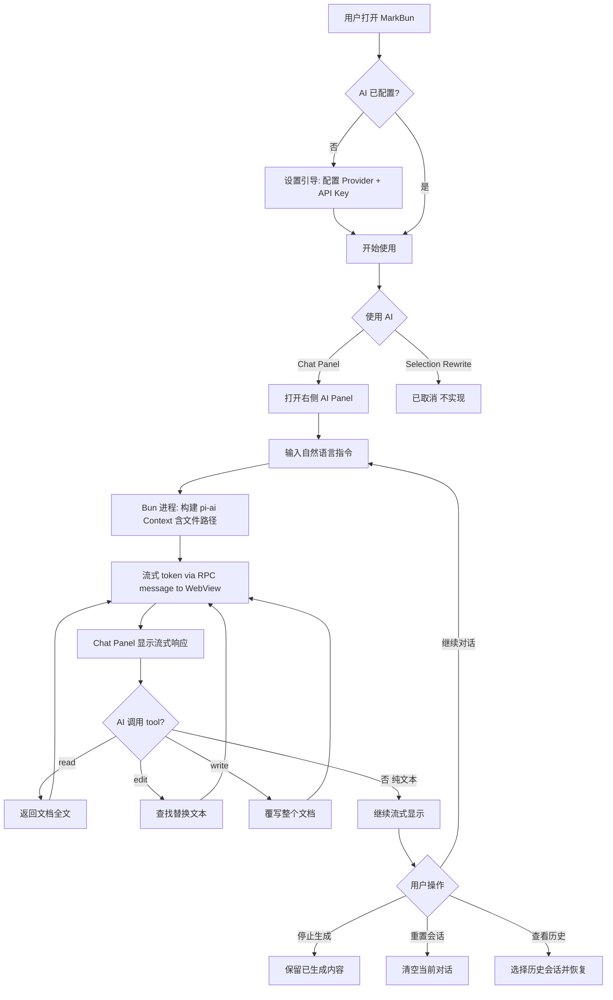

# MarkBun v0.6.0 AI Support

## Problem Frame

MarkBun v0.5.0 是一个功能完整的桌面 Markdown 编辑器，但缺少 AI 辅助写作能力。v0.6.0 的目标是将 AI 作为**智能编辑助手**集成到编辑器中——AI 可以阅读用户文档、理解上下文、直接操作文档内容（改写、插入、替换），而非仅仅作为旁置的聊天机器人。

目标用户：使用 MarkBun 进行日常写作的中文/英文用户，包括技术文档作者、博客写作者、学术研究者。

## User Flow

## Requirements

**Settings and Configuration**

- R1. 在 `src/shared/settings/schema.ts` 中新增 `ai` 嵌套配置节，包含：`enabled`（boolean，是否启用 AI）、`provider`（string，如 `ollama`/`anthropic`/`openai`）、`model`（string，模型 ID）、`baseUrl`（string，可选覆盖）、`localOnly`（boolean，仅使用本地模型）。注意：`apiKey` 不在 Zod schema 中（见 R3），需同时更新 `AppSettings` 类型（types.ts）和 `index.ts` 中的 Settings↔AppSettings 映射
- R2. SettingsDialog 新增第 6 个 "AI" 标签页，渲染 AI 配置表单。Provider 选择为预设下拉列表配合 Model 选择。预设 Provider 分两组展示：(1) 国际：Ollama / Anthropic / OpenAI / Google / OpenRouter；(2) 国内：DeepSeek / Kimi（月之暗面）/ GLM（智谱）/ Qwen（通义千问）/ MiniMax / Doubao（豆包/火山引擎）。国内 Provider 均使用 OpenAI 兼容 API（pi-ai `openai-completions` provider + 自定义 baseUrl）。另提供 "自定义" 选项允许输入任意 OpenAI 兼容 API 地址
- R3. API Key 存储在 `~/.config/markbun/ai-keys.json`（独立于 settings.json，不在 Zod schema 中），Bun 主进程读取后注入 pi-ai SDK。`ai-keys.json` 文件权限设为 0600（仅 owner 可读）。`getSettings` RPC 绝不返回 API Key 值到 WebView，仅返回掩码标识（如 `sk-...xxxx`）。Settings UI 中 API Key 字段为密码类型输入框
- R4. 设置页包含 "Test Connection" 按钮，验证 Provider + Model + API Key 连通性，显示成功/失败提示
- R5. 当 `localOnly = true` 时，Provider 下拉仅显示 Ollama 选项，API Key 字段隐藏
- R6. AI 设置变更后，Bun 主进程热重载 pi-ai provider 配置，无需重启应用

**Streaming RPC Bridge**

- R7. 在 `src/shared/types.ts` 的 `MarkBunRPC.bun.messages` 中新增流式消息类型，承载 pi-ai 的 streaming events：`text_delta`（文本增量）、`toolcall_start`（工具调用开始）、`toolcall_delta`（工具参数增量）、`toolcall_end`（工具调用完成）、`done`（生成完成，含 token 用量）、`error`（错误，含错误消息和是否可重试标识）
- R8. Bun 主进程作为 LLM 代理：接收 WebView 的 AI 请求 RPC，调用 pi-ai `stream()`，将 streaming event 通过 RPC message 推送到 WebView。使用缓冲批处理（50ms 间隔或累积 3 个 token，先到先发）以避免高频消息淹没 RPC 通道
- R9. WebView 端通过 `electrobun.on('ai-stream-event', callback)` 监听流式事件，累积到 React 状态中渲染。流式错误处理：收到 `error` event 时，已渲染的文本保留并标记为截断（显示内联错误提示 + 可选 "重试" 按钮）。Provider 中断与用户中止区分显示
- R10. 支持中止生成：用户点击 Stop 后，WebView 发送 `aiAbort` RPC，Bun 主进程调用 `AbortController.abort()`，已生成的文本保留在 Chat Panel 中

**AI Chat Panel (Right Sidebar)**

- R11. 新增独立的右侧面板组件，与左侧 Sidebar（files/outline）完全分离。两者可同时显示。AI Panel 默认隐藏，遵循 chromeless 设计哲学。面板可见性和宽度持久化到 UIState。当左 sidebar 和右 AI panel 同时打开时，编辑器区域保留至少 50% 窗口宽度。用户不打开 AI 面板时，编辑器完全正常工作，AI 功能零影响
- R12. 面板通过 View 菜单中的 "Toggle AI Panel" 选项打开/关闭（也可用快捷键），支持宽度调整（可拖拽边缘，最小 280px，最大 600px）。AI 相关菜单项在 AI 未配置时仍可见但灰显
- R13. 面板包含会话头部区域：显示当前使用的模型名称 + 会话操作菜单（重置当前会话、查看历史会话列表）
- R14. 会话消息列表：渲染对话历史，AI 消息支持 Markdown 渲染（代码块、表格、列表等）
- R15. 底部输入区域：文本输入框 + 发送按钮。生成中显示 "Stop" 按钮替代发送按钮
- R16. 全局单一活跃会话。System prompt 仅包含当前打开文件的路径信息，不包含文档内容。AI 通过 `read` tool 按需读取文档内容，而非自动注入。切换文件时，system prompt 中的文件路径自动更新，消息历史自动清空以避免旧文件上下文干扰。当 AI 未配置时（`enabled=false` 或无 API Key），Chat Panel 显示引导设置界面（非空白），右键 AI 菜单项灰显
- R17. 会话管理支持三种操作：(a) 重置——清空当前对话，创建新 Context；(b) 查看历史——按时间排序列出过去所有会话；(c) 恢复——选择历史会话继续对话
- R18. 会话数据持久化到 `~/.config/markbun/ai-sessions/` 目录，使用 pi-ai 的 JSON-serializable Context 格式。应用重启后自动恢复上次活跃会话

**AI Tool Calls (Editor Integration)**

v0.6.0 采用 3 个原子工具（read/edit/write），所有操作都是纯 markdown 文本操作，不依赖编辑器焦点、光标或选区状态：

- R19. `read` tool：无参数。返回当前文档完整 markdown 内容（`editorRef.getMarkdown()`）。AI 通过此工具按需读取文档内容，system prompt 不注入文档内容
- R20. `edit` tool：参数 `{ old_text: string, new_text: string }`。在文档中查找 `old_text` 并替换为 `new_text`（所有匹配）。返回替换次数。如果找不到文本则返回错误。使用 `split/join` 实现以避免正则转义问题
- R21. `write` tool：参数 `{ content: string }`。用新内容完全覆写文档（`editorRef.setMarkdown(content)`）。用于大范围重写、格式化等场景
- R22. 所有 tool call 通过 `webview.requests.executeAITool` RPC 执行（Bun→WebView 方向），WebView 端通过 `window.__markbunAI[tool](args)` 分发到具体工具实现。执行结果（成功/失败 + 返回值）反馈给 AI，支持多轮 tool call。Tool call 执行结果在 Chat Panel 中以可折叠块展示（显示工具名 + 状态图标），用户可展开查看详情
- R22a. Tool call 失败时，错误信息必须反馈给 AI 以维持对话状态（不允许静默丢弃错误）

**Selection-Aware AI Actions** — ❌ 已取消，v0.6.0 不实现

~R24-R28 已取消。~ Selection-Aware AI Actions（右键 AI 操作菜单、选区替换）在 v0.6.0 中不做。用户可以通过 Chat Panel + `edit` tool 完成同样的操作，且避免了选区焦点管理等复杂问题。

**i18n-Aware AI Prompts**

- R29. 系统提示自动注入文档语言信息（基于 i18n 设置或内容自动检测），明确指示 AI 以文档语言回复
- R30. 所有 AI 操作的内置指令（改进写作、简化等）随应用语言本地化，存储在 i18n locale 文件中

## Success Criteria

- 用户完成 AI 设置后，能在右侧 Chat Panel 与 AI 进行多轮对话，AI 能通过 read/edit/write tool calls 读取和修改文档内容
- 切换文件后 AI 对话上下文自动重置，system prompt 中的文件路径自动更新，AI 通过 `read` tool 按需读取新文件
- 关闭并重启 MarkBun 后，AI 会话自动恢复
- Ollama 本地模式和云端 API 模式均可正常工作
- 中文文档的 AI 操作结果为中文，不会产生英文输出

## Scope Boundaries

- **不含** Inline diff 预览（红绿标注 accept/reject UI）
- **不含** 多 Provider 路由或负载均衡（v0.6.0 只使用一个配置的 model）
- **不含** Cost dashboard 或 token 用量统计面板
- **不含** 多文件 Agent（自动读取工作区多文件并综合分析）
- **不含** Semantic search（语义搜索）
- **不含** 独立的 AI 自动校对模式（inline annotations）
- **不含** Ghost-text inline completion（Copilot 风格的灰色补全）
- **不含** 移动端支持

## Key Decisions

- **AI 定位为智能编辑助手**：AI 通过 3 个原子 tool calls（read/edit/write）操作文档，所有操作都是纯 markdown 文本操作，不依赖编辑器焦点、光标或选区状态
- **本地 + 云端双支持**：Ollama 和云端 Provider 并重，"仅本地模式" 作为设置选项
- **按需读取文档上下文**：system prompt 只包含当前文件路径，不包含文档内容。AI 通过 `read` tool 按需读取，节省 context window 空间并让 AI 自主决定读取策略
- **原子化工具设计**：只提供 3 个工具（read/edit/write），避免 insertAtCursor 等依赖编辑器状态的工具。edit 使用 find-and-replace 语义（split/join），write 使用 setMarkdown 覆写
- **全局单一会话**：一个活跃对话，当前文件作为上下文，支持重置。文件切换时对话上下文自动重置（清空消息历史）
- **右侧独立面板**：AI Chat Panel 在右侧，默认隐藏，与左侧 Sidebar 分离，可同时显示
- **首次云端使用需用户知情**：使用非本地 Provider 时，首次 AI 调用前显示一次性提示说明文档内容将发送到云端服务

## Dependencies / Assumptions

- 依赖 `@mariozechner/pi-ai` npm 包（需验证 Bun 兼容性）
- 假设 Electrobun 的 RPC messages 通道支持足够频率的消息推送（可能需要缓冲批处理）
- 假设 pi-ai 的 Context 对象跨版本序列化兼容（或需要迁移逻辑）
- 依赖现有 ProseMirror transaction 系统支持原子化 Undo

## Outstanding Questions

### Resolve Before Planning

- **pi-ai Bun 兼容性验证**：在规划前执行 spike，在 Bun 环境中安装 pi-ai 并验证至少一个 provider（Ollama）的 stream() 和 complete() 可正常工作。如不兼容，需评估替代方案（直接使用各 provider SDK）
- **Electrobun RPC messages 吞吐量验证**：测试 100+ msg/s 的 RPC message 交付率和延迟，验证流式传输可行性。如不达标，考虑 WebSocket 替代方案

### Deferred to Planning

- [Affects R11-R12] 右侧面板的具体 React 组件结构和状态管理方案
- [Affects R7-R9] RPC message 缓冲批处理的具体参数调优（基于实测吞吐量）
- [Affects R16-R18] 会话持久化的文件结构设计（单文件 vs 每对话一个文件）+ 会话文件大小管理策略（AI 调用 read 的结果可能在 Context 中累积）
- [Affects R1-R3] pi-ai 各 provider 的初始化方式差异（env var vs explicit key vs OAuth）

## Next Steps

-> `/ce:plan` for structured implementation planning
