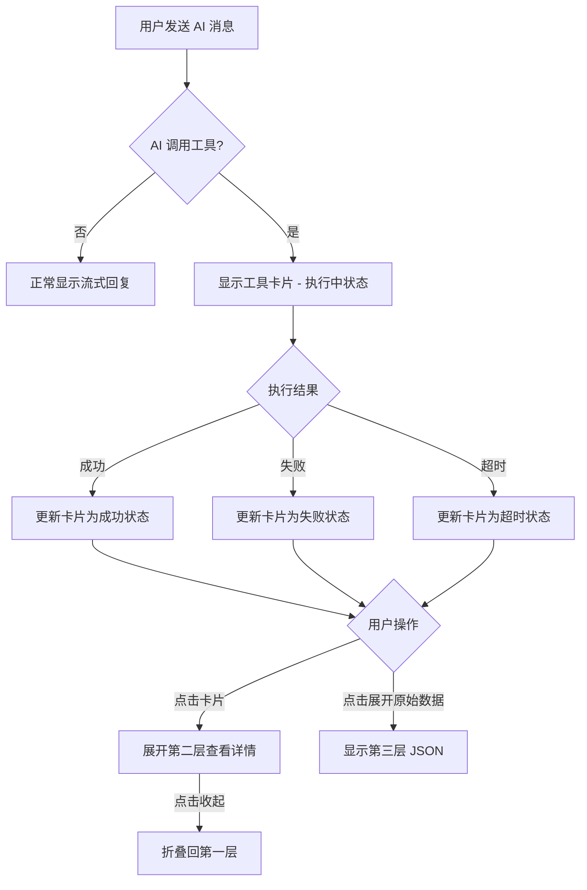

# AI 工具调用显示与交互优化

## Problem Frame

当前 MarkBun v0.6.0 的 AI Chat Panel 中，当 AI 调用工具（read/edit/write）时，执行结果直接显示为原始 JSON 字符串（如 `{"content":"古诗词大会\n"}`）。这种显示方式存在以下问题：

1. **用户不友好**：JSON 格式对非技术用户不直观
2. **信息密度低**：用户需要阅读代码来理解内容
3. **空间占用高**：长文档内容直接显示会淹没对话流
4. **缺乏反馈**：用户无法感知工具执行的开始、进行和完成
5. **无视觉区分**：不同工具类型没有可区分的视觉标识

本优化目标是将工具调用结果从"原始 JSON 展示"升级为"结构化、可视化、有反馈的用户友好展示"。

## Requirements

### 分层折叠卡片架构

**R1. 卡片容器结构**
- 每个工具调用封装为一个可折叠卡片容器
- 卡片高度紧凑，默认只显示头部信息区
- 头部信息区始终可见：工具图标 + 工具名称 + 执行状态 + 执行耗时

**R2. 三层渐进式信息披露**
- **第一层（默认折叠）**：头部摘要信息
- **第二层（点击展开）**：格式化详情（diff预览/统计摘要/内容预览）
- **第三层（再次点击/展开）**：原始 JSON 数据（调试用途，使用 `<details>` 元素）

**R3. 展开/折叠交互**
- 点击卡片头部切换第二层展开/折叠状态
- 第二层内包含"原始数据"折叠区域（第三层）
- 展开状态仅保存在组件本地状态，不持久化

### 工具视觉标识系统

**R4. 工具类型专属标识**
每种工具分配专属图标和主题色：

| 工具 | 图标 | 主题色 | 色值 |
|------|------|--------|------|
| read | 👁 (Eye) | 蓝色 | `blue-500` / `#3b82f6` |
| edit | ✏️ (Pencil) | 琥珀色 | `amber-500` / `#f59e0b` |
| write | 📝 (FileText) | 绿色 | `green-500` / `#22c55e` |

**R5. 视觉标识应用位置**
- 卡片头部左侧显示工具图标
- 图标颜色为主题色
- 卡片左侧边框使用主题色（`border-l-4`）
- 执行状态指示器颜色与主题色相协调

### 执行状态反馈

**R6. 状态类型与视觉表现**

| 状态 | 图标 | 颜色 | 动画 | 显示内容 |
|------|------|------|------|----------|
| 执行中 | 脉冲圆点 | 主题色 | pulse 动画 | 工具名 + "执行中..." + 已耗时 |
| 成功 | 勾选 (Check) | 绿色 | 无 | 工具名 + "完成" + 总耗时 |
| 失败 | 叉号 (X) | 红色 | 无 | 工具名 + "失败" + 错误摘要 |
| 超时 | 警告 (AlertTriangle) | 橙色 | 无 | 工具名 + "超时" |

**R7. 时间显示**
- 显示相对执行耗时（如 "120ms"、"2.3s"）
- 执行中实时更新已耗时（100ms 刷新间隔）
- 超过 1 秒时显示为 "1.2s" 格式，低于 1 秒显示为 "120ms"

**R8. 错误信息展示**
- 失败状态卡片头部显示红色错误图标
- 显示简要错误信息（最多 30 字符，超出截断加"..."）
- 完整错误信息折叠在第二层内
- 支持错误重试操作（如适用）

### 工具特定展示格式

**R9. read 工具展示**
- 第一层："👁 已读取文档 · 1,234 字 · 56 行 · 约 300 tokens · 120ms"
- 第二层：前 500 字符内容预览 + "查看完整内容"按钮
- 完整内容以 `<pre>` 代码块形式展示，支持滚动

**R10. edit 工具展示**
- 第一层："✏️ 已修改文档 · 替换 3 处 · 影响 120 字 · 85ms"
- 第二层：diff 视图展示
  - 使用行内 diff 展示每处修改
  - 删除内容：红色背景 + 删除线
  - 新增内容：绿色背景 + 高亮
  - 每处修改之间用省略号分隔
- 若修改超过 3 处，显示前 3 处 + "... 还有 2 处"

**R11. write 工具展示**
- 第一层："📝 已写入文档 · 1,234 字 · 56 行 · 95ms"
- 第二层：内容前 300 字符预览 + 渐变淡出效果
- 提供"查看完整内容"展开按钮

### i18n 支持

**R12. 国际化键值**
新增以下 i18n 键（8 种语言）：

```json
{
  "tool": {
    "read": "读取文档",
    "edit": "修改文档",
    "write": "写入文档",
    "executing": "执行中...",
    "completed": "完成",
    "failed": "失败",
    "timeout": "超时",
    "stats": {
      "chars": "{{count}} 字",
      "lines": "{{count}} 行",
      "tokens": "约 {{count}} tokens",
      "replacements": "替换 {{count}} 处",
      "time": "{{time}}ms"
    },
    "viewFullContent": "查看完整内容",
    "collapse": "收起",
    "expand": "展开",
    "rawData": "原始数据"
  }
}
```

## User Flow



## Component Structure

```
ChatMessageList
└── ChatMessage (role='tool')
    └── ToolCallCard
        ├── CardHeader (始终可见)
        │   ├── ToolIcon (图标+颜色)
        │   ├── ToolName (工具名称)
        │   ├── StatusIndicator (状态+动画)
        │   └── ExecutionTime (耗时)
        ├── CardBody (可展开)
        │   ├── read: ContentStats + ContentPreview
        │   ├── edit: DiffView
        │   ├── write: ContentStats + ContentPreview
        │   └── ErrorMessage (失败时)
        └── CardFooter (原始数据折叠区)
            └── RawJSON
```

## Success Criteria

- 用户能一眼识别工具类型（通过图标和颜色）
- 用户能立即看到工具执行状态（成功/失败/超时）和性能
- read 工具的长内容不会淹没对话流，统计信息提供足够上下文
- edit 工具的修改内容通过 diff 视图直观展示
- 调试时用户可以查看原始 JSON 数据
- 所有文本支持 8 种语言切换

## Scope Boundaries

- **不含** 编辑器内实时高亮（inline decorations）— 这是 Phase 2 的"编辑器联动预览"
- **不含** 工具链时间线可视化 — 这是 Phase 2 的功能
- **不含** 工具重试机制（UI 按钮）— 需要 backend 支持
- **不含** 工具执行取消 — 当前架构不支持中途取消工具执行
- **不含** 工具参数编辑（让用户修改参数后再执行）— 超出当前范围

## Key Decisions

1. **相对时间显示**：显示执行耗时（如 "120ms"）而非绝对时间戳，突出性能感知
2. **独立工具展示**：每个工具独立显示，不按组折叠，保持简单直接
3. **read 完全折叠**：默认只显示统计信息，避免长文档占用空间
4. **edit diff 视图**：默认展示 diff 而非摘要，修改内容最直观
5. **错误折叠展示**：错误详情折叠在卡片内，头部只显示简要信息
6. **三层渐进披露**：头部摘要 → 格式化详情 → 原始 JSON，满足不同用户需求

## Dependencies / Assumptions

- 依赖现有的 `ai-stream.ts` 事件系统（`toolcall_start` / `toolcall_end`）
- 假设工具执行耗时可以通过 `toolcall_start` 到 `toolcall_end` 的时间差计算
- 依赖现有的 `AIMessage` 类型（需要确保 `toolName` 和 `toolResult` 字段存在）
- diff 视图依赖 edit 工具的 `old_text` / `new_text` 参数在结果中可用（可能需要 backend 调整）

## Outstanding Questions

### Resolve Before Planning

- [Affects R10] **Diff 视图数据来源**：edit 工具的 diff 展示需要 `old_text` 和 `new_text`。当前 `toolcall_end` 事件是否包含这些参数？如果不包含，backend 是否需要调整？
- [Affects R9-R11] **Token 估算算法**：read/edit/write 的 token 统计显示需要一个估算算法。是使用简单的 "中文字符/4" 估算，还是需要更精确的 tokenizer？

### Deferred to Planning

- [Affects R6] **时间刷新频率**：执行中状态的计时器刷新频率（100ms 是否合适？）
- [Affects R9-R11] **内容截断长度**：read（500字符）、write（300字符）的预览长度是否需要根据面板宽度动态调整？
- [Affects R10] **Diff 截断策略**：当修改处很多时，显示前 N 处 + "...还有 X 处" 的策略
- [Affects all] **动画性能**：脉冲动画和展开/折叠动画的性能优化（是否需要使用 `will-change`？）

## Next Steps

→ `/ce:plan` for structured implementation planning
