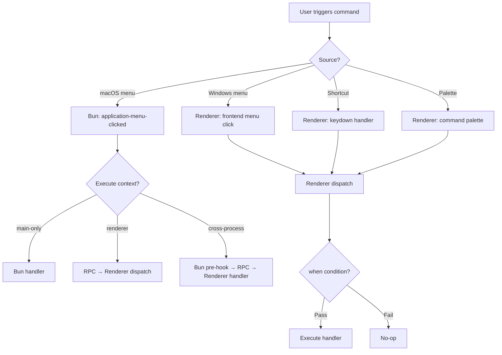

# Single-Source Command & Menu Manifest

## Problem Frame

Adding a menu command in MarkBun requires updating 6+ locations across the codebase: `menu.ts` (native menu builder), `types.ts` (RPC types), `commandRegistry.ts` (command palette), `electrobun.ts` (RPC client), `App.tsx` (handler), `actionToEvent` table (routing), and `application-menu-clicked` handler (macOS dispatch). This duplication causes:

- **Sync drift** — `commandRegistry.ts` line 2 explicitly warns it is "manually enumerated" from `menu.ts`
- **Silent failures** — dual dispatch paths (macOS native menu vs Windows RPC) have already caused macOS actions to silently break
- **State blindness** — no mechanism to disable commands contextually (e.g., "Save" when no file is open)
- **Compounding cost** — v0.5.0 will add many new commands (find/replace, tab chrome, command palette enhancement), multiplying the pain

The existing `commandRegistry.ts` already captures ~75% of what the manifest needs (action, i18nKey, accelerator, category for 68 commands). The refactor will extend it in-place by adding menu placement, execution context, when/toggled conditions, and platform overrides.

## Architecture Constraint: Dual-Process Dispatch

MarkBun runs on two processes: **Bun main process** (native menu, file I/O, window management) and **WebView renderer** (editor, UI, React). Commands can only be executed on one side or require coordination across both. This is a fundamental constraint that the unified dispatch must accommodate:

- **Renderer-only commands** (format-strong, para-heading-1, editor-cut): handler lives in WebView, no RPC needed
- **Main-process-only commands** (view-toggle-devtools, window-new, app-quit): handler lives in Bun, no renderer involvement
- **Cross-process commands** (file-new clears `filePath` in Bun THEN notifies renderer; view-toggle-sidebar updates native menu checked state AND sends toggle event to renderer): both sides participate

The unified dispatch is therefore a **two-layer system**: each process has its own dispatch, and the manifest marks each command's execution context.

## Requirements

**Command Manifest (Single Source of Truth)**

- R1. All command metadata defined in the extended `commandRegistry.ts`: action ID, i18n key, accelerator, category, menu placement, execution context (`main` | `renderer` | `cross-process`), optional `when` condition, and optional `toggled` condition
- R2. Command manifest is the sole input for generating macOS native menu tree, Windows frontend menu config, and command palette entries
- R3. Manifest entries support platform-specific overrides (e.g., macOS-only items, different accelerators per platform)

**Unified Command Dispatch**

- R4. Command triggers converge on the unified dispatch path in two phases:
  - **Phase 1**: native menu clicks (macOS), frontend menu clicks (Windows), and command palette selections all route through `commandRegistry.execute(actionId)`. The existing keydown handler (App.tsx lines 1378-1533) remains unchanged — it calls handlers directly
  - **Phase 2**: keyboard shortcuts also route through the unified dispatch, replacing the direct-call keydown handler. This is deferred because the keydown handler has complex context-sensitive logic (input/textarea detection, source-mode branching, search-mode gating) that doesn't map cleanly to action IDs, and converting it adds RPC latency to currently-synchronous operations
- R5. The dispatch path evaluates the command's `when` condition before executing; disabled commands are silently ignored. On macOS, native menu items are visually grayed out when disabled; on Windows, the frontend menu renders disabled items accordingly
- R6. The `actionToEvent` mapping table and the `application-menu-clicked` switch statement are replaced by the unified dispatch. For cross-process commands, the manifest defines a `mainHandler` (Bun-side) and/or `rendererAction` (renderer-side) so the dispatch knows where to route

**Handler Registration**

- R7. Command handlers are registered via `registerHandler(actionId, handlerFn)`. When the same action ID is registered twice, the last registration wins. Calling `execute()` for an action with no registered handler is a silent no-op with a console warning in development
- R8. Handlers can be registered from any module with a stable lifetime (App.tsx top level, module-level code, services). React component functions that mount/unmount must NOT register handlers directly — they should use refs or register at module level
- R9. Adding a new **frontend-only** command requires changes in 2 files: the manifest (metadata) and one handler registration file (behavior). Adding a command that needs a new backend RPC or new i18n keys necessarily involves additional files — this is structural, not accidental. The success criterion is scoped accordingly

**Command State Management**

- R10. Commands may specify a `when` condition: a callback `(context) => boolean` evaluated at dispatch time. Context is a flat object of boolean/string values maintained by the application (e.g., `hasOpenFile`, `editorReady`, `hasSelection`, `isSourceMode`). The initial implementation supports single-key checks and AND-combinations only
- R11. Context values are updated explicitly by application code (`context.set('hasOpenFile', true)`), not derived reactively from React state. This avoids stale-closure issues and keeps the system debuggable
- R12. Menu items reflect enabled/disabled state based on their `when` condition. On macOS, this requires rebuilding the native menu when context changes (the ApplicationMenu API is full-replace). On Windows, the frontend menu reads context on render. **macOS menu rebuilds are triggered only by low-frequency context keys** (`hasOpenFile`, `editorReady`, `isSourceMode`) — NOT by high-frequency keys like `hasSelection` or `isDirty` which change on every cursor movement or keystroke. Commands using high-frequency keys rely on R5's silent-no-op behavior at dispatch time instead of visual disablement in the native menu

**Toggle State**

- R13. Commands may specify a `toggled` context key (distinct from `when`): a key whose boolean value maps to the native menu `checked` property. This covers the five View menu toggles (sidebar, titlebar, toolbar, statusbar, source mode). `when` controls enablement (grayed out); `toggled` controls checkmark state

## Success Criteria

- Adding a new **frontend-only** command (no new RPC, no new i18n keys) touches exactly 2 files: manifest + handler registration, down from 6+
- Adding a command that requires new RPC or new i18n keys involves the minimum necessary additional files — no duplication beyond what the architecture structurally requires
- Command palette entries auto-sync with menu definitions — zero manual sync
- Contextual command state works: e.g., "Save" is disabled when no file is open, "Copy" disabled when nothing is selected
- macOS and Windows both route through the unified dispatch
- All existing commands (~68 in commandRegistry, plus context-menu-only and role-based items) migrate with no known regressions in manually verified scenarios. Pre-migration audit identifies commands missing from commandRegistry (e.g., `toggle-ai-panel`) and commands that exist only in dispatch handlers but not in the manifest
- Context menu actions continue to work — they already share the `menuAction` dispatch path and will be absorbed into the unified dispatch

## Scope Boundaries

- **Not building** custom keybinding UI — accelerators remain defined in manifest only
- **Not building** plugin/extension command registration API
- **Not changing** visual appearance of existing menus
- **Not removing** Electrobun `role`-based menu items (hide, hideOthers, quit, showAll) — these are native-only and don't need the command system
- Context menu commands (right-click) are **in scope** for unified dispatch since they already route through the same `menuAction` channel. However, context menu item definitions (showTableContextMenu, showDefaultContextMenu in index.ts) remain separate — they construct menus dynamically per cursor context

## Key Decisions

- **Keep dual platform menus**: macOS uses Electrobun native `ApplicationMenu`, Windows uses frontend-rendered menu. Manifest generates configs for both. (Rationale: VS Code follows this pattern; native menus provide better macOS integration)
- **Two-layer dispatch**: Unified dispatch exists on both sides of the IPC boundary, with the manifest marking each command's execution context. (Rationale: handlers fundamentally live in different processes; pretending otherwise would create a misleading abstraction)
- **Extend existing commandRegistry.ts**: The current file already has 68 entries with action/i18nKey/accelerator/category. Adding menu placement, execution context, when/toggled conditions, and platform overrides is a smaller change than creating a new file from scratch. (Rationale: smaller migration, proven data shape)
- **Explicit context updates over reactive subscriptions**: Context is updated by explicit `context.set()` calls, not derived from React state. (Rationale: avoids stale-closure bugs, debuggable, no hidden reactivity)
- **Incremental migration with coexistence period**: Both old dispatch paths and new unified dispatch coexist during migration. A command migrates when its manifest entry + handler registration are complete. The old paths are removed once all commands have migrated. (Rationale: big-bang is too risky for 70+ commands with no integration tests)

## Dependencies / Assumptions

- Electrobun's `ApplicationMenu.setApplicationMenu()` is a full-replace API — there is no incremental update. Native menu rebuilds on context changes must account for this (debouncing, selective rebuild triggers)
- The `when` condition system is intentionally limited: single-key checks and AND-combinations only. NOT building a VS Code-style expression evaluator. This can be relaxed later if needed
- Migration safety depends on having no integration tests — behavioral regression must be verified manually or via CDP-based self-test

## Outstanding Questions

### Resolve Before Planning

- **Pre-migration audit**: Enumerate all action strings from menu.ts, index.ts (actionToEvent + application-menu-clicked + context-menu handlers), and commandRegistry.ts. Identify gaps: commands in menu.ts but not commandRegistry (e.g., `toggle-ai-panel`), commands in dispatch handlers but not in menu (e.g., `file-export-pdf`), context-menu-only actions (e.g., `table-copy-cell`). This audit produces the definitive migration checklist

### Deferred to Planning

- [Affects R1][Technical] Exact field additions to commandRegistry.ts CommandEntry interface and data migration for 68 existing entries
- [Affects R6][Technical] How to handle commands with main-process side effects (file-new clearing filePath, view toggles updating ViewMenuState) in the manifest's execution context model
- [Affects R12][Technical] Strategy for macOS native menu rebuilds — debounce interval, selective rebuild triggers, or accept full rebuild on every context change
- [Affects R9][Technical] Concrete migration order — which command group migrates first (format/paragraph as lowest-risk, file operations as highest-risk)

## Next Steps

→ `/ce:plan` for structured implementation planning
