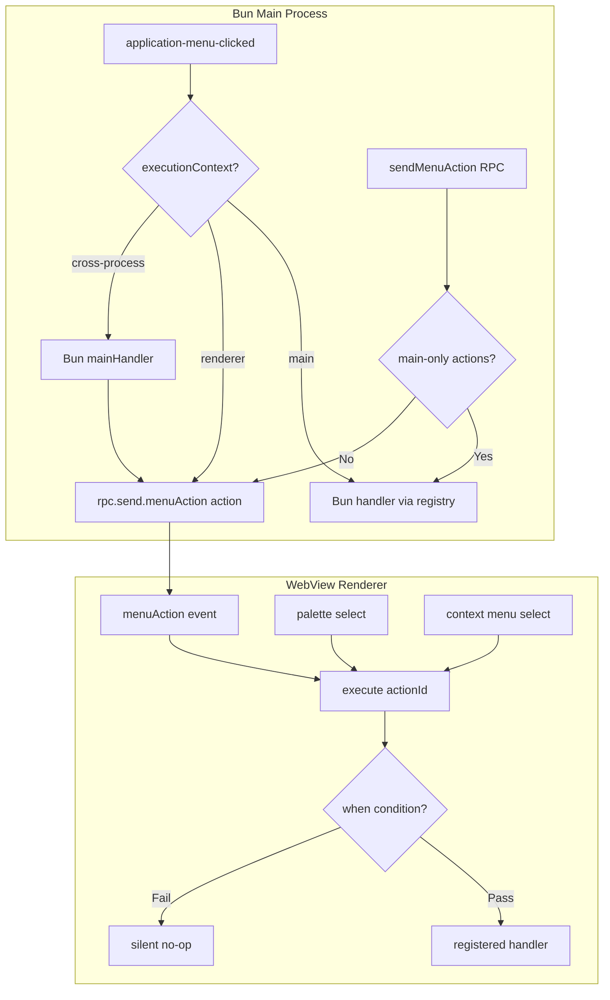

***

title: "refactor: Single-Source Command & Menu Manifest"
type: refactor
status: active
date: 2026-04-06
origin: docs/brainstorms/2026-04-06-single-source-command-manifest-requirements.md
----------------------------------------------------------------------------------

# refactor: Single-Source Command & Menu Manifest

## Overview

Unify MarkBun's command/menu system so that all command metadata lives in one source of truth and all dispatch paths converge on a single execution pipeline. Currently, adding a menu command requires touching 6+ files with manual sync. After this refactor, adding a frontend-only command touches exactly 2 files: the manifest and one handler registration file.

## Problem Frame

Adding a menu command in MarkBun today requires coordinated edits to `menu.ts`, `types.ts`, `commandRegistry.ts`, `electrobun.ts`, `App.tsx`, and `index.ts` — with no compile-time or runtime enforcement of consistency. This has already caused a real regression: `toggle-ai-panel` silently failed on macOS because it was registered in only one of two dispatch paths (see origin: `docs/solutions/ui-bugs/macos-menu-action-dispatch-bug-2026-04-03.md`).

The dual-process architecture (Bun main + WebView renderer) means commands fundamentally execute on one or both sides. The manifest must model this explicitly rather than hiding it behind a leaky abstraction.

## Requirements Trace

* R1. All command metadata in extended `commandRegistry.ts`: action ID, i18n key, accelerator, category, menu placement, execution context, optional `when`/`toggled` conditions

* R2. Manifest is the sole input for generating macOS native menu, Windows frontend menu, and command palette entries

* R3. Platform-specific overrides in manifest entries

* R4. Unified dispatch for native menu clicks, frontend menu clicks, and command palette selections (Phase 1). Keyboard shortcuts deferred to Phase 2

* R5. `when` condition evaluation before execution; disabled commands are silent no-ops. macOS grays out; Windows frontend menu disables

* R6. `actionToEvent` mapping table and `application-menu-clicked` switch statement replaced by unified dispatch

* R7. Handler registration via `registerHandler(actionId, handlerFn)`. Last registration wins. Unregistered handlers are silent no-ops with dev console warning

* R8. Handlers registered from stable-lifetime modules only, not React render functions

* R9. New frontend-only command: 2 files (manifest + handler). New commands needing RPC/i18n involve minimum additional files

* R10. `when` conditions: callback `(context) => boolean`. Single-key checks and AND-combinations only

* R11. Explicit context updates via `context.set()`, not reactive

* R12. Menu reflects enabled/disabled state. macOS rebuilds on low-frequency context keys only. High-frequency keys use silent no-op at dispatch time

* R13. `toggled` context key maps to native menu `checked` property. Covers 5 View menu toggles

## Scope Boundaries

* **Not building** custom keybinding UI

* **Not building** plugin/extension command registration API

* **Not changing** visual appearance of existing menus

* **Not removing** Electrobun `role`-based menu items (hide, hideOthers, quit, showAll)

* **Phase 2** (keyboard shortcuts through unified dispatch) is explicitly deferred — the keydown handler has complex input/source/search mode branching

* Context menu **item definitions** (which items appear per cursor context) remain separate imperative code. Only action **dispatch** is unified

## Context & Research

### Relevant Code and Patterns

* `src/shared/commandRegistry.ts` — 57 `CommandEntry` objects with `action`, `i18nKey`, `accelerator?`, `category`. Comment warns "manually enumerated from menu.ts"

* `src/bun/menu.ts` — `setupMenu(state, tFn)` builds native menu tree. `getMenuConfig()` exposes Windows config. `ViewMenuState` for 5 toggles

* `src/bun/index.ts` — Two dispatch paths: `ApplicationMenu.on('application-menu-clicked')` (macOS switch, ~200 lines) and `sendMenuAction` RPC handler (actionToEvent lookup + switch)

* `src/mainview/App.tsx` — `electrobun.on()` listeners (14 useEffects) for named events; `menuAction` handler with formatActions/paragraphActions/switch; keydown handler (1378-1533)

* `src/mainview/lib/electrobun.ts` — 14 named message handlers + client API wrapping `electroview.rpc.request.*`

* `src/mainview/components/menu/AppMenuBar.tsx` — Windows-only React menu bar, calls `electrobun.sendMenuAction()`

* `src/bun/ipc/commandHistory.ts` — Stores last 30 command actions for palette recency

* `AGENTS.md` — Canonical "Add a New Menu Item" 5-step checklist with complete data flow diagram

### Institutional Learnings

* **Dual dispatch bug** (`docs/solutions/ui-bugs/macos-menu-action-dispatch-bug-2026-04-03.md`): Every menu action must be registered in BOTH macOS `application-menu-clicked` switch AND Windows `actionToEvent` table. Missing one silently fails on that platform

* **Electrobun RPC limitations** (`docs/solutions/integration-issues/ai-tool-call-cascading-failures-rpc-stream-lifecycle-2026-04-04.md`): No `evaluateJavascriptWithResponse`. Bun→WebView with return values must use `webview.rpc.request` pattern

* **Editor mode switching** (`docs/solutions/ui-bugs/clipboard-editor-multimode-race-conditions-2026-04-05.md`): Never put side effects in `setState` updaters. Use `requestAnimationFrame` polling on `ref.isReady`

* **ProseMirror state bridge** (`docs/solutions/logic-errors/editor-content-lost-on-file-switch-2026-04-04.md`): Crepe's `markdownUpdated` never fires for programmatic `setMarkdown`. Use `$prose` plugin. One-way ratchet for `isDirty`

### External References

* None. The codebase has strong local patterns for all required functionality. No external research needed.

## Key Technical Decisions

* **Sequential cross-process execution**: Cross-process commands run Bun-side `mainHandler` first, then renderer-side `rendererAction`. This preserves current behavior and avoids the race where renderer queries stale Bun state. (see origin: Architecture Constraint section)

<br />

* **Renderer-side dispatch as primary**: `commandRegistry.execute(actionId)` lives in the renderer. For renderer-only commands, this is direct execution. For macOS native menu clicks, Bun's `application-menu-clicked` handler calls `webview.rpc.send.menuAction({action})` which triggers the renderer-side dispatch. Main-process-only commands are handled by a Bun-side dispatch that intercepts before forwarding to renderer. (Rationale: minimizes IPC round-trips for renderer-only commands — see flow analysis G6)

* **Filter disabled commands from palette**: The command palette evaluates `when` conditions and hides commands that would no-op. Menus show grayed items; palette hides them entirely. (Rationale: palette is for execution, not discovery)

* **Each side evaluates its own** **`when`** **conditions**: The process owning the command's handler evaluates the condition. Cross-process commands evaluate on the originating side. (Rationale: avoids cross-process context sync complexity)

* **Migration by removal**: A command "migrates" by being removed from the old dispatch paths (switch statement, actionToEvent table). Both old and new paths can handle the same action during migration — handler registration is idempotent (last-wins, R7), and the old inline handlers simply stop being called when the switch cases are removed. (Rationale: no double-execution risk because old cases are deleted as part of migration)

* **Fix view toggle double-rebuild as part of migration**: The current view toggle path triggers two `setupMenu()` calls (one from `updateViewMenuState`, one from `saveUIState`). The unified dispatch will collapse this into a single coordinated update. (see flow analysis G1)

## Open Questions

### Resolved During Planning

* **Pre-migration audit scope**: Enumerate all action strings from menu.ts, index.ts (macOS switch + actionToEvent + context-menu), commandRegistry.ts, and App.tsx (menuAction handler + keydown handler). Cross-reference to identify gaps. The audit is the first implementation unit

* **Command palette disabled command behavior**: Filter from palette (hide, not dim). Documented in Key Technical Decisions

* **Cross-process ordering**: Sequential (Bun first, renderer second). Documented in Key Technical Decisions

* **`when`** **condition evaluation side**: Each side evaluates its own. Documented in Key Technical Decisions

* **Context menu dispatch**: Unified dispatch handles action execution only. Context menu item definitions remain separate. Per scope boundaries

### Deferred to Implementation

* **Exact field names and types for extended** **`CommandEntry`**: The schema extension needs to be designed in context of the actual data. Direction: add `menuPath`, `executionContext`, `when?`, `toggled?`, `platformOverrides?`

* **Debounce interval for macOS native menu rebuilds**: Needs empirical testing. Start with 100ms debounce on low-frequency context key changes

* **Migration order within each group**: Which specific format command migrates first, etc. Low risk — group order matters, intra-group order doesn't

* **Exact handler registration API shape**: Whether `registerHandler` is a standalone function, a method on a dispatcher object, or uses a different pattern. Depends on how it integrates with existing App.tsx structure

## High-Level Technical Design

> *This illustrates the intended approach and is directional guidance for review, not implementation specification. The implementing agent should treat it as context, not code to reproduce.*

### Command Manifest Schema Extension

```typescript
// Directional sketch — field names approximate
interface CommandEntry {
  action: string;           // existing
  i18nKey: string;          // existing
  accelerator?: string;     // existing
  category: CommandCategory;// existing

  // New fields:
  menuPath?: string[];      // e.g., ['Format', 'Strong'] for menu tree placement
  executionContext: 'main' | 'renderer' | 'cross-process';
  when?: (ctx: CommandContext) => boolean;
  toggled?: string;         // context key name for checked state
  platformOverrides?: {
    macOS?: Partial<Pick<CommandEntry, 'accelerator' | 'menuPath' | 'visible'>>;
    windows?: Partial<Pick<CommandEntry, 'accelerator' | 'menuPath' | 'visible'>>;
  };
}
```

### Two-Layer Dispatch Architecture



### Command Context Model

```typescript
// Directional sketch
const context = {
  _values: new Map<string, boolean | string>(),
  set(key: string, value: boolean | string) { ... },
  get(key: string) { ... },
};

// Low-frequency keys (trigger menu rebuild on change):
// hasOpenFile, editorReady, isSourceMode
// High-frequency keys (dispatch-time check only):
// hasSelection, isDirty
```

<br />

* **Renderer-side dispatch as primary**: `commandRegistry.execute(actionId)` lives in the renderer. For renderer-only commands, this is direct execution. For macOS native menu clicks, Bun's `application-menu-clicked` handler calls `webview.rpc.send.menuAction({action})` which triggers the renderer-side dispatch. Main-process-only commands are handled by a Bun-side dispatch that intercepts before forwarding to renderer. (Rationale: minimizes IPC round-trips for renderer-only commands — see flow analysis G6)

* **Filter disabled commands from palette**: The command palette evaluates `when` conditions and hides commands that would no-op. Menus show grayed items; palette hides them entirely. (Rationale: palette is for execution, not discovery)

* **Each side evaluates its own** **`when`** **conditions**: The process owning the command's handler evaluates the condition. Cross-process commands evaluate on the originating side. (Rationale: avoids cross-process context sync complexity)

* **Migration by removal**: A command "migrates" by being removed from the old dispatch paths (switch statement, actionToEvent table). Both old and new paths can handle the same action during migration — handler registration is idempotent (last-wins, R7), and the old inline handlers simply stop being called when the switch cases are removed. (Rationale: no double-execution risk because old cases are deleted as part of migration)

* **Fix view toggle double-rebuild as part of migration**: The current view toggle path triggers two `setupMenu()` calls (one from `updateViewMenuState`, one from `saveUIState`). The unified dispatch will collapse this into a single coordinated update. (see flow analysis G1)

## Open Questions

### Resolved During Planning

* **Pre-migration audit scope**: Enumerate all action strings from menu.ts, index.ts (macOS switch + actionToEvent + context-menu), commandRegistry.ts, and App.tsx (menuAction handler + keydown handler). Cross-reference to identify gaps. The audit is the first implementation unit

* **Command palette disabled command behavior**: Filter from palette (hide, not dim). Documented in Key Technical Decisions

* **Cross-process ordering**: Sequential (Bun first, renderer second). Documented in Key Technical Decisions

* **`when`** **condition evaluation side**: Each side evaluates its own. Documented in Key Technical Decisions

* **Context menu dispatch**: Unified dispatch handles action execution only. Context menu item definitions remain separate. Per scope boundaries

### Deferred to Implementation

* **Exact field names and types for extended** **`CommandEntry`**: The schema extension needs to be designed in context of the actual data. Direction: add `menuPath`, `executionContext`, `when?`, `toggled?`, `platformOverrides?`

* **Debounce interval for macOS native menu rebuilds**: Needs empirical testing. Start with 100ms debounce on low-frequency context key changes

* **Migration order within each group**: Which specific format command migrates first, etc. Low risk — group order matters, intra-group order doesn't

* **Exact handler registration API shape**: Whether `registerHandler` is a standalone function, a method on a dispatcher object, or uses a different pattern. Depends on how it integrates with existing App.tsx structure

## High-Level Technical Design

> *This illustrates the intended approach and is directional guidance for review, not implementation specification. The implementing agent should treat it as context, not code to reproduce.*

### Command Manifest Schema Extension

```typescript
// Directional sketch — field names approximate
interface CommandEntry {
  action: string;           // existing
  i18nKey: string;          // existing
  accelerator?: string;     // existing
  category: CommandCategory;// existing

  // New fields:
  menuPath?: string[];      // e.g., ['Format', 'Strong'] for menu tree placement
  executionContext: 'main' | 'renderer' | 'cross-process';
  when?: (ctx: CommandContext) => boolean;
  toggled?: string;         // context key name for checked state
  platformOverrides?: {
    macOS?: Partial<Pick<CommandEntry, 'accelerator' | 'menuPath' | 'visible'>>;
    windows?: Partial<Pick<CommandEntry, 'accelerator' | 'menuPath' | 'visible'>>;
  };
}
```

### Two-Layer Dispatch Architecture


### Command Context Model

```typescript
// Directional sketch
const context = {
  _values: new Map<string, boolean | string>(),
  set(key: string, value: boolean | string) { ... },
  get(key: string) { ... },
};

// Low-frequency keys (trigger menu rebuild on change):
// hasOpenFile, editorReady, isSourceMode
// High-frequency keys (dispatch-time check only):
// hasSelection, isDirty
```

<br />

### Handler Registration Pattern

```typescript
// Directional sketch — registration at module top level or App.tsx top level
registerHandler('format-strong', (ctx) => {
  editorRef.current?.toggleBold();
});

registerHandler('file-save', {
  mainHandler: (fw) => { fw.state.filePath = ... },
  rendererAction: (ctx) => { handleSave() },
}, { when: (ctx) => ctx.get('hasOpenFile') });
```

## Implementation Units

### Phase A: Foundation

* [ ] **Unit 1: Pre-Migration Audit**

**Goal:** Produce the definitive migration checklist by enumerating all action strings across all dispatch locations and cross-referencing against the command registry.

**Requirements:** R1, R6 (establishes what the manifest must cover)

**Dependencies:** None

**Files:**

* Reference: `src/shared/commandRegistry.ts` (57 COMMANDS entries)

* Reference: `src/bun/menu.ts` (menu tree action strings)

* Reference: `src/bun/index.ts` (application-menu-clicked switch, sendMenuAction handler, actionToEvent table, context-menu-clicked handler)

* Reference: `src/mainview/App.tsx` (menuAction handler, keydown handler)

* Create: `docs/migration-audit.md` (audit report)

**Approach:**

* Enumerate every unique action string from 6 sources: commandRegistry COMMANDS array, menu.ts menu tree, index.ts macOS switch statement, index.ts actionToEvent table, index.ts context-menu handler, App.tsx menuAction handler

* Cross-reference to identify: (a) actions in menu but not registry, (b) actions in dispatch but not menu, (c) context-menu-only actions, (d) keydown-only shortcuts, (e) role-based native items (excluded from manifest)

<br />

* Known gaps to confirm: `toggle-ai-panel` (missing from COMMANDS), `table-copy-cell` (context-menu-only), `file-export-pdf` (in macOS switch only), `app-about` (potentially duplicated)

* Output a table with columns: action | in COMMANDS | in menu.ts | in macOS switch | in actionToEvent | in App.tsx handler | execution context | migration status

**Test expectation: none — this is a research/deliverable unit, not a code change**

**Verification:** Audit report covers all 6 dispatch sources and identifies every gap. Every action string in the codebase is accounted for.

***

* [ ] **Unit 2: Extend Command Manifest Schema**

**Goal:** Add new fields to `CommandEntry` and migrate all existing entries to the extended schema.

**Requirements:** R1, R3

**Dependencies:** Unit 1 (audit identifies all commands to include)

**Files:**

* Modify: `src/shared/commandRegistry.ts`

* Test: `tests/unit/shared/commandRegistry.test.ts`

**Approach:**

* Extend `CommandEntry` interface with: `menuPath`, `executionContext`, `when?`, `toggled?`, `platformOverrides?`

* Migrate all 57+ existing entries to include the new fields. Every entry gets `menuPath` (derived from current menu.ts tree position) and `executionContext` (derived from audit — most are `'renderer'`, cross-process commands are `'cross-process'`, main-only are `'main'`)

* Add missing entries identified by audit: `toggle-ai-panel`, `table-copy-cell`, and any others discovered

* Only ~10 entries need `when` conditions (save/saveAs need `hasOpenFile`, copy/cut need `hasSelection` — though `hasSelection` is high-frequency and won't trigger rebuilds)

* 5 entries need `toggled` fields (the View toggles)

* Platform overrides only for items that differ (e.g., macOS-only items, different accelerators)

**Patterns to follow:**

* Existing `CommandEntry` interface and `COMMANDS` array structure in `commandRegistry.ts`

* `CommandCategory` union type for categories

**Test scenarios:**

* Happy path: every COMMANDS entry has required new fields (menuPath, executionContext), all existing fields preserved

* Edge case: entries with no accelerator still have `accelerator?: undefined`

* Edge case: platform overrides are optional and partial

* Happy path: new entries (toggle-ai-panel, table-copy-cell, etc.) are added with correct metadata

<br />

### Handler Registration Pattern

```typescript
// Directional sketch — registration at module top level or App.tsx top level
registerHandler('format-strong', (ctx) => {
  editorRef.current?.toggleBold();
});

registerHandler('file-save', {
  mainHandler: (fw) => { fw.state.filePath = ... },
  rendererAction: (ctx) => { handleSave() },
}, { when: (ctx) => ctx.get('hasOpenFile') });
```

## Implementation Units

### Phase A: Foundation

* [ ] **Unit 1: Pre-Migration Audit**

**Goal:** Produce the definitive migration checklist by enumerating all action strings across all dispatch locations and cross-referencing against the command registry.

**Requirements:** R1, R6 (establishes what the manifest must cover)

**Dependencies:** None

**Files:**

* Reference: `src/shared/commandRegistry.ts` (57 COMMANDS entries)

* Reference: `src/bun/menu.ts` (menu tree action strings)

* Reference: `src/bun/index.ts` (application-menu-clicked switch, sendMenuAction handler, actionToEvent table, context-menu-clicked handler)

* Reference: `src/mainview/App.tsx` (menuAction handler, keydown handler)

* Create: `docs/migration-audit.md` (audit report)

**Approach:**

* Enumerate every unique action string from 6 sources: commandRegistry COMMANDS array, menu.ts menu tree, index.ts macOS switch statement, index.ts actionToEvent table, index.ts context-menu handler, App.tsx menuAction handler

* Cross-reference to identify: (a) actions in menu but not registry, (b) actions in dispatch but not menu, (c) context-menu-only actions, (d) keydown-only shortcuts, (e) role-based native items (excluded from manifest)

<br />

* Known gaps to confirm: `toggle-ai-panel` (missing from COMMANDS), `table-copy-cell` (context-menu-only), `file-export-pdf` (in macOS switch only), `app-about` (potentially duplicated)

* Output a table with columns: action | in COMMANDS | in menu.ts | in macOS switch | in actionToEvent | in App.tsx handler | execution context | migration status

**Test expectation: none — this is a research/deliverable unit, not a code change**

**Verification:** Audit report covers all 6 dispatch sources and identifies every gap. Every action string in the codebase is accounted for.

***

* [ ] **Unit 2: Extend Command Manifest Schema**

**Goal:** Add new fields to `CommandEntry` and migrate all existing entries to the extended schema.

**Requirements:** R1, R3

**Dependencies:** Unit 1 (audit identifies all commands to include)

**Files:**

* Modify: `src/shared/commandRegistry.ts`

* Test: `tests/unit/shared/commandRegistry.test.ts`

**Approach:**

* Extend `CommandEntry` interface with: `menuPath`, `executionContext`, `when?`, `toggled?`, `platformOverrides?`

* Migrate all 57+ existing entries to include the new fields. Every entry gets `menuPath` (derived from current menu.ts tree position) and `executionContext` (derived from audit — most are `'renderer'`, cross-process commands are `'cross-process'`, main-only are `'main'`)

* Add missing entries identified by audit: `toggle-ai-panel`, `table-copy-cell`, and any others discovered

* Only ~10 entries need `when` conditions (save/saveAs need `hasOpenFile`, copy/cut need `hasSelection` — though `hasSelection` is high-frequency and won't trigger rebuilds)

* 5 entries need `toggled` fields (the View toggles)

* Platform overrides only for items that differ (e.g., macOS-only items, different accelerators)

**Patterns to follow:**

* Existing `CommandEntry` interface and `COMMANDS` array structure in `commandRegistry.ts`

* `CommandCategory` union type for categories

**Test scenarios:**

* Happy path: every COMMANDS entry has required new fields (menuPath, executionContext), all existing fields preserved

* Edge case: entries with no accelerator still have `accelerator?: undefined`

* Edge case: platform overrides are optional and partial

* Happy path: new entries (toggle-ai-panel, table-copy-cell, etc.) are added with correct metadata

<br />

* Edge case: role-based native items (hide, hideOthers, quit, showAll) are NOT in the manifest

**Verification:** All existing commands compile with new schema. No command lost in migration. `COMMANDS.length` >= 57 (existing) + new entries from audit.

***

* [ ] **Unit 3: Unified Dispatch Core**

**Goal:** Build the `CommandDispatcher` with handler registration, context management, `when`/`toggled` evaluation, and `execute()`.

**Requirements:** R5, R7, R8, R10, R11, R12, R13

**Dependencies:** Unit 2 (schema defines what the dispatch operates on)

**Files:**

* Create: `src/shared/commandDispatch.ts` (core dispatcher, shared between processes)

* Create: `src/bun/services/commandDispatch.ts` (Bun-side dispatch wrapper)

* Create: `src/mainview/lib/commandDispatch.ts` (renderer-side dispatch wrapper)

* Test: `tests/unit/shared/commandDispatch.test.ts`

* Test: `tests/unit/bun/services/commandDispatch.test.ts`

**Approach:**

* **Core dispatcher** (shared): `registerHandler(actionId, handlerFn)`, `execute(actionId)`, `getContext()`, `setContext(key, value)`. `execute()` looks up the manifest entry, evaluates `when` condition against context, then calls the registered handler or logs a dev warning

* **Context model**: `CommandContext` class with `set(key, value)`, `get(key)`. Tracks which keys changed to trigger menu rebuilds. Low-frequency keys (`hasOpenFile`, `editorReady`, `isSourceMode`) are marked as rebuild triggers

* **Renderer-side wrapper**: Wraps core dispatcher. On `execute()`, also evaluates `when` for palette filtering. Exposes `getVisibleCommands()` for palette

* **Bun-side wrapper**: Wraps core dispatcher for main-process-only commands. On `application-menu-clicked`, checks `executionContext`: if `main`, runs Bun handler; if `renderer` or `cross-process`, forwards to renderer

* **Handler registration is module-level**: No registration inside React render functions. App.tsx registers at top level or in module-level setup functions

**Patterns to follow:**

* Handler registration pattern from AI tools (`window.__markbunAI` in `src/mainview/lib/ai-tools.ts`)

* Context pattern from settings service (explicit set/get, not reactive)

* Module-level initialization pattern from `commandHistory.ts`

**Test scenarios:**

* Happy path: `registerHandler('test', fn)` then `execute('test')` calls `fn`

* Happy path: `execute('unknown')` produces dev console warning, no crash (R7)

* Happy path: last-registered handler wins when registered twice (R7)

* Edge case: `execute` with no registered handler is silent no-op + warning

* Happy path: `when` condition returns false → handler not called (R5)

* Happy path: `context.set('hasOpenFile', true)` updates context, `context.get('hasOpenFile')` returns true

* Edge case: `when` condition references undefined context key → treated as false

* Happy path: `toggled` context key maps to boolean state

* Integration: low-frequency context change triggers rebuild callback; high-frequency change does not

* Edge case: `execute()` called before any handlers registered → dev warning

**Verification:** Dispatcher registers and executes handlers. `when` conditions gate execution. Context updates work. Low-frequency key changes trigger rebuild callback. All tests pass.

***

* [ ] **Unit 4: Menu Generation from Manifest**

**Goal:** Replace the manual menu tree in `menu.ts` with auto-generation from the command manifest.

**Requirements:** R2, R3, R12, R13

**Dependencies:** Unit 2 (schema), Unit 3 (context for when/toggled state)

**Files:**

* Modify: `src/bun/menu.ts`

* Test: `tests/unit/bun/menu.test.ts`

**Approach:**

* Replace `setupMenu(state, tFn)` body with a function that reads `COMMANDS` and generates the menu tree using `menuPath` for hierarchy, `i18nKey` for labels, `accelerator` for shortcuts, `toggled` for checked state, and `when` for enabled state

* Preserve the existing i18n lookup via `tFn` — the manifest has `i18nKey`, menu generation calls `tFn(i18nKey)` for labels

* Preserve `ViewMenuState` integration — the 5 toggles read from context (which replaces `ViewMenuState`)

* `getMenuConfig()` (for Windows frontend menu) also reads from manifest — eliminates the need for a separate menu config

* Platform filtering: skip entries where `platformOverrides.macOS.visible === false` on macOS, etc.

* Menu rebuild triggers: `setupMenu()` is called when low-frequency context keys change (Unit 3's rebuild callback)

<br />

* Edge case: role-based native items (hide, hideOthers, quit, showAll) are NOT in the manifest

**Verification:** All existing commands compile with new schema. No command lost in migration. `COMMANDS.length` >= 57 (existing) + new entries from audit.

***

* [ ] **Unit 3: Unified Dispatch Core**

**Goal:** Build the `CommandDispatcher` with handler registration, context management, `when`/`toggled` evaluation, and `execute()`.

**Requirements:** R5, R7, R8, R10, R11, R12, R13

**Dependencies:** Unit 2 (schema defines what the dispatch operates on)

**Files:**

* Create: `src/shared/commandDispatch.ts` (core dispatcher, shared between processes)

* Create: `src/bun/services/commandDispatch.ts` (Bun-side dispatch wrapper)

* Create: `src/mainview/lib/commandDispatch.ts` (renderer-side dispatch wrapper)

* Test: `tests/unit/shared/commandDispatch.test.ts`

* Test: `tests/unit/bun/services/commandDispatch.test.ts`

**Approach:**

* **Core dispatcher** (shared): `registerHandler(actionId, handlerFn)`, `execute(actionId)`, `getContext()`, `setContext(key, value)`. `execute()` looks up the manifest entry, evaluates `when` condition against context, then calls the registered handler or logs a dev warning

* **Context model**: `CommandContext` class with `set(key, value)`, `get(key)`. Tracks which keys changed to trigger menu rebuilds. Low-frequency keys (`hasOpenFile`, `editorReady`, `isSourceMode`) are marked as rebuild triggers

* **Renderer-side wrapper**: Wraps core dispatcher. On `execute()`, also evaluates `when` for palette filtering. Exposes `getVisibleCommands()` for palette

* **Bun-side wrapper**: Wraps core dispatcher for main-process-only commands. On `application-menu-clicked`, checks `executionContext`: if `main`, runs Bun handler; if `renderer` or `cross-process`, forwards to renderer

* **Handler registration is module-level**: No registration inside React render functions. App.tsx registers at top level or in module-level setup functions

**Patterns to follow:**

* Handler registration pattern from AI tools (`window.__markbunAI` in `src/mainview/lib/ai-tools.ts`)

* Context pattern from settings service (explicit set/get, not reactive)

* Module-level initialization pattern from `commandHistory.ts`

**Test scenarios:**

* Happy path: `registerHandler('test', fn)` then `execute('test')` calls `fn`

* Happy path: `execute('unknown')` produces dev console warning, no crash (R7)

* Happy path: last-registered handler wins when registered twice (R7)

* Edge case: `execute` with no registered handler is silent no-op + warning

* Happy path: `when` condition returns false → handler not called (R5)

* Happy path: `context.set('hasOpenFile', true)` updates context, `context.get('hasOpenFile')` returns true

* Edge case: `when` condition references undefined context key → treated as false

* Happy path: `toggled` context key maps to boolean state

* Integration: low-frequency context change triggers rebuild callback; high-frequency change does not

* Edge case: `execute()` called before any handlers registered → dev warning

**Verification:** Dispatcher registers and executes handlers. `when` conditions gate execution. Context updates work. Low-frequency key changes trigger rebuild callback. All tests pass.

***

* [ ] **Unit 4: Menu Generation from Manifest**

**Goal:** Replace the manual menu tree in `menu.ts` with auto-generation from the command manifest.

**Requirements:** R2, R3, R12, R13

**Dependencies:** Unit 2 (schema), Unit 3 (context for when/toggled state)

**Files:**

* Modify: `src/bun/menu.ts`

* Test: `tests/unit/bun/menu.test.ts`

**Approach:**

* Replace `setupMenu(state, tFn)` body with a function that reads `COMMANDS` and generates the menu tree using `menuPath` for hierarchy, `i18nKey` for labels, `accelerator` for shortcuts, `toggled` for checked state, and `when` for enabled state

* Preserve the existing i18n lookup via `tFn` — the manifest has `i18nKey`, menu generation calls `tFn(i18nKey)` for labels

* Preserve `ViewMenuState` integration — the 5 toggles read from context (which replaces `ViewMenuState`)

* `getMenuConfig()` (for Windows frontend menu) also reads from manifest — eliminates the need for a separate menu config

* Platform filtering: skip entries where `platformOverrides.macOS.visible === false` on macOS, etc.

* Menu rebuild triggers: `setupMenu()` is called when low-frequency context keys change (Unit 3's rebuild callback)

<br />

* Keep the Electrobun `role`-based items (hide, hideOthers, showAll, quit) as static additions outside the manifest

**Patterns to follow:**

* Existing `setupMenu(state, tFn)` structure for menu tree shape

* Existing `ApplicationMenuItemConfig` type for menu item format

* Existing `getMenuConfig()` for Windows menu config

**Test scenarios:**

* Happy path: generated menu has correct hierarchy (File, Edit, Format, Paragraph, View, Help)

* Happy path: menu items have correct labels from i18n lookup

* Happy path: accelerators match manifest entries

* Happy path: toggled items show `checked: true/false` based on context

* Edge case: commands with `when` returning false have `enabled: false` in generated menu

* Edge case: platform-specific items are filtered per platform

* Happy path: role-based native items (hide, etc.) are appended outside manifest

* Integration: full menu tree matches current manual tree (regression check)

* Edge case: empty `menuPath` → command appears in palette but not in menu bar

**Verification:** Generated menu tree is structurally identical to current manual tree. All labels, accelerators, checked states, and enabled states match. Windows menu config also generated correctly.

***

### Phase B: Migration

* [ ] **Unit 5: Renderer Handler Registration Infrastructure**

**Goal:** Set up the handler registration pattern in App.tsx and migrate the renderer-side dispatch entry point.

**Requirements:** R4, R7, R8

**Dependencies:** Unit 3 (dispatch core), Unit 4 (menu generation)

**Files:**

* Modify: `src/mainview/App.tsx`

* Modify: `src/mainview/lib/electrobun.ts`

* Modify: `src/bun/index.ts` (Bun-side dispatch integration)

**Approach:**

* Add renderer dispatch entry point: when `menuAction` event arrives, call `execute(actionId)` instead of the current formatActions/paragraphActions/switch

* Register all renderer-side handlers at App.tsx top level (outside render function), using stable refs for editorRef etc.

* Bun-side: `application-menu-clicked` handler checks `executionContext` from manifest — if `renderer`, sends `menuAction({action})`; if `main`, runs Bun handler; if `cross-process`, runs Bun mainHandler then sends action to renderer

* The old `formatActions`, `paragraphActions`, and inline switch cases in App.tsx are replaced by registered handlers

* The old `actionToEvent` table in index.ts is replaced by manifest-driven routing

**Execution note:** Migrate format commands first (lowest risk — renderer-only, no state side effects, easy to verify visually)

**Patterns to follow:**

* Current `menuAction` handler pattern in App.tsx for event reception

* Handler registration in ai-tools.ts for module-level registration pattern

* `electrobun.on('menuAction', ...)` for event listener setup

**Test scenarios:**

* Happy path: menu click triggers registered handler via `execute(actionId)`

* Happy path: command palette selection triggers registered handler

* Happy path: context menu selection triggers registered handler

* Edge case: handler registered after component mount still works (module-level registration)

* Integration: format-strong from menu produces same effect as before (editor toggles bold)

* Integration: para-heading-1 from palette produces same effect as before

* Edge case: cross-process command (file-new) runs Bun handler first, then renderer handler

**Verification:** All renderer-only commands (format, paragraph, table, edit) work identically via unified dispatch. Command palette routes through dispatch. Context menu routes through dispatch. macOS and Windows both work.

***

* [ ] **Unit 6: Migrate Cross-Process Commands**

**Goal:** Migrate file operations and view toggle commands that require coordination between Bun and renderer.

**Requirements:** R4, R6, R12, R13

* Keep the Electrobun `role`-based items (hide, hideOthers, showAll, quit) as static additions outside the manifest

**Patterns to follow:**

* Existing `setupMenu(state, tFn)` structure for menu tree shape

* Existing `ApplicationMenuItemConfig` type for menu item format

* Existing `getMenuConfig()` for Windows menu config

**Test scenarios:**

* Happy path: generated menu has correct hierarchy (File, Edit, Format, Paragraph, View, Help)

* Happy path: menu items have correct labels from i18n lookup

* Happy path: accelerators match manifest entries

* Happy path: toggled items show `checked: true/false` based on context

* Edge case: commands with `when` returning false have `enabled: false` in generated menu

* Edge case: platform-specific items are filtered per platform

* Happy path: role-based native items (hide, etc.) are appended outside manifest

* Integration: full menu tree matches current manual tree (regression check)

* Edge case: empty `menuPath` → command appears in palette but not in menu bar

**Verification:** Generated menu tree is structurally identical to current manual tree. All labels, accelerators, checked states, and enabled states match. Windows menu config also generated correctly.

***

### Phase B: Migration

* [ ] **Unit 5: Renderer Handler Registration Infrastructure**

**Goal:** Set up the handler registration pattern in App.tsx and migrate the renderer-side dispatch entry point.

**Requirements:** R4, R7, R8

**Dependencies:** Unit 3 (dispatch core), Unit 4 (menu generation)

**Files:**

* Modify: `src/mainview/App.tsx`

* Modify: `src/mainview/lib/electrobun.ts`

* Modify: `src/bun/index.ts` (Bun-side dispatch integration)

**Approach:**

* Add renderer dispatch entry point: when `menuAction` event arrives, call `execute(actionId)` instead of the current formatActions/paragraphActions/switch

* Register all renderer-side handlers at App.tsx top level (outside render function), using stable refs for editorRef etc.

* Bun-side: `application-menu-clicked` handler checks `executionContext` from manifest — if `renderer`, sends `menuAction({action})`; if `main`, runs Bun handler; if `cross-process`, runs Bun mainHandler then sends action to renderer

* The old `formatActions`, `paragraphActions`, and inline switch cases in App.tsx are replaced by registered handlers

* The old `actionToEvent` table in index.ts is replaced by manifest-driven routing

**Execution note:** Migrate format commands first (lowest risk — renderer-only, no state side effects, easy to verify visually)

**Patterns to follow:**

* Current `menuAction` handler pattern in App.tsx for event reception

* Handler registration in ai-tools.ts for module-level registration pattern

* `electrobun.on('menuAction', ...)` for event listener setup

**Test scenarios:**

* Happy path: menu click triggers registered handler via `execute(actionId)`

* Happy path: command palette selection triggers registered handler

* Happy path: context menu selection triggers registered handler

* Edge case: handler registered after component mount still works (module-level registration)

* Integration: format-strong from menu produces same effect as before (editor toggles bold)

* Integration: para-heading-1 from palette produces same effect as before

* Edge case: cross-process command (file-new) runs Bun handler first, then renderer handler

**Verification:** All renderer-only commands (format, paragraph, table, edit) work identically via unified dispatch. Command palette routes through dispatch. Context menu routes through dispatch. macOS and Windows both work.

***

* [ ] **Unit 6: Migrate Cross-Process Commands**

**Goal:** Migrate file operations and view toggle commands that require coordination between Bun and renderer.

**Requirements:** R4, R6, R12, R13

**Dependencies:** Unit 5 (renderer infrastructure)

**Files:**

* Modify: `src/bun/index.ts` (remove old switch cases and actionToEvent entries)

* Modify: `src/mainview/App.tsx` (remove old useEffect listeners, replace with handler registrations)

* Modify: `src/bun/menu.ts` (remove manual ViewMenuState integration, use context)

**Approach:**

* File operations (`file-new`, `file-open`, `file-save`, `file-save-as`, `file-open-folder`): register as cross-process with Bun-side mainHandler (clears filePath, opens dialog, etc.) and renderer-side rendererAction (updates editor content, dirty state, etc.)

* View toggles (`view-toggle-sidebar`, `view-toggle-titlebar`, `view-toggle-toolbar`, `view-toggle-statusbar`, `view-toggle-source-mode`): register as cross-process. Bun-side updates native menu checked state. Renderer-side updates React state. Fix double-rebuild by having the toggle handler update context + trigger a single `setupMenu()` call

* `toggle-ai-panel`: add to manifest (currently missing from COMMANDS), register as renderer-only

* `app-preferences`, `file-history`, `app-about`: register as cross-process (Bun-side may do setup, renderer-side opens dialog)

* Remove old `actionToEvent` lookup table entries as commands migrate

* Remove old macOS `application-menu-clicked` switch cases as commands migrate

* Remove old `useEffect` listeners in App.tsx as commands migrate

**Patterns to follow:**

* Current cross-process patterns in index.ts switch statement for ordering (Bun-first, renderer-second)

* Current ViewMenuState update pattern for toggle state management

**Test scenarios:**

* Happy path: `file-new` from menu clears filePath in Bun and resets editor in renderer

* Happy path: `file-save` from menu saves content via Bun and clears isDirty in renderer

* Happy path: `view-toggle-sidebar` updates native menu checked state AND toggles sidebar in renderer

<br />

* Edge case: `file-save` when no file is open → `when` condition prevents execution

* Edge case: view toggle double-rebuild is eliminated (only one `setupMenu()` call per toggle)

* Integration: macOS Cmd+S triggers same path as menu Save

* Integration: Windows menu Save routes through same dispatch

* Edge case: `toggle-ai-panel` (previously missing from registry) now works on both platforms

**Verification:** All cross-process commands work on both macOS and Windows. View toggles update both native menu and renderer state with single rebuild. File operations correctly coordinate between processes. `toggle-ai-panel` no longer silently fails on macOS.

***

* [ ] **Unit 7: Migrate Main-Process Commands**

**Goal:** Migrate commands that execute entirely in the Bun main process.

**Requirements:** R4, R6

**Dependencies:** Unit 3 (dispatch core)

**Files:**

* Modify: `src/bun/index.ts` (remove old switch cases)

**Approach:**

* `window-new`, `view-toggle-devtools`, `help-open`, `app-quit`: register as `main` execution context with Bun-side handlers only

* These commands never forward to renderer. The Bun-side dispatch intercepts them before sending anything to WebView

* Remove the corresponding switch cases from `application-menu-clicked` handler

* On Windows path (`sendMenuAction`), these are already handled in the main-process switch — migrate to use manifest lookup instead

**Test scenarios:**

* Happy path: `window-new` opens new window

* Happy path: `view-toggle-devtools` toggles dev tools

* Happy path: `help-open` opens help window

* Edge case: `app-quit` on macOS is role-based (stays native) vs Windows (needs handler)

**Verification:** All main-process commands work via unified dispatch. No renderer involvement for these commands.

***

* [ ] **Unit 8: Command Palette Integration**

**Goal:** Update command palette to use live dispatch with `when` condition filtering.

**Requirements:** R2, R5, R9

**Dependencies:** Unit 5 (renderer handler registration)

**Dependencies:** Unit 5 (renderer infrastructure)

**Files:**

* Modify: `src/bun/index.ts` (remove old switch cases and actionToEvent entries)

* Modify: `src/mainview/App.tsx` (remove old useEffect listeners, replace with handler registrations)

* Modify: `src/bun/menu.ts` (remove manual ViewMenuState integration, use context)

**Approach:**

* File operations (`file-new`, `file-open`, `file-save`, `file-save-as`, `file-open-folder`): register as cross-process with Bun-side mainHandler (clears filePath, opens dialog, etc.) and renderer-side rendererAction (updates editor content, dirty state, etc.)

* View toggles (`view-toggle-sidebar`, `view-toggle-titlebar`, `view-toggle-toolbar`, `view-toggle-statusbar`, `view-toggle-source-mode`): register as cross-process. Bun-side updates native menu checked state. Renderer-side updates React state. Fix double-rebuild by having the toggle handler update context + trigger a single `setupMenu()` call

* `toggle-ai-panel`: add to manifest (currently missing from COMMANDS), register as renderer-only

* `app-preferences`, `file-history`, `app-about`: register as cross-process (Bun-side may do setup, renderer-side opens dialog)

* Remove old `actionToEvent` lookup table entries as commands migrate

* Remove old macOS `application-menu-clicked` switch cases as commands migrate

* Remove old `useEffect` listeners in App.tsx as commands migrate

**Patterns to follow:**

* Current cross-process patterns in index.ts switch statement for ordering (Bun-first, renderer-second)

* Current ViewMenuState update pattern for toggle state management

**Test scenarios:**

* Happy path: `file-new` from menu clears filePath in Bun and resets editor in renderer

* Happy path: `file-save` from menu saves content via Bun and clears isDirty in renderer

* Happy path: `view-toggle-sidebar` updates native menu checked state AND toggles sidebar in renderer

<br />

* Edge case: `file-save` when no file is open → `when` condition prevents execution

* Edge case: view toggle double-rebuild is eliminated (only one `setupMenu()` call per toggle)

* Integration: macOS Cmd+S triggers same path as menu Save

* Integration: Windows menu Save routes through same dispatch

* Edge case: `toggle-ai-panel` (previously missing from registry) now works on both platforms

**Verification:** All cross-process commands work on both macOS and Windows. View toggles update both native menu and renderer state with single rebuild. File operations correctly coordinate between processes. `toggle-ai-panel` no longer silently fails on macOS.

***

* [ ] **Unit 7: Migrate Main-Process Commands**

**Goal:** Migrate commands that execute entirely in the Bun main process.

**Requirements:** R4, R6

**Dependencies:** Unit 3 (dispatch core)

**Files:**

* Modify: `src/bun/index.ts` (remove old switch cases)

**Approach:**

* `window-new`, `view-toggle-devtools`, `help-open`, `app-quit`: register as `main` execution context with Bun-side handlers only

* These commands never forward to renderer. The Bun-side dispatch intercepts them before sending anything to WebView

* Remove the corresponding switch cases from `application-menu-clicked` handler

* On Windows path (`sendMenuAction`), these are already handled in the main-process switch — migrate to use manifest lookup instead

**Test scenarios:**

* Happy path: `window-new` opens new window

* Happy path: `view-toggle-devtools` toggles dev tools

* Happy path: `help-open` opens help window

* Edge case: `app-quit` on macOS is role-based (stays native) vs Windows (needs handler)

**Verification:** All main-process commands work via unified dispatch. No renderer involvement for these commands.

***

* [ ] **Unit 8: Command Palette Integration**

**Goal:** Update command palette to use live dispatch with `when` condition filtering.

**Requirements:** R2, R5, R9

**Dependencies:** Unit 5 (renderer handler registration)

**Files:**

* Modify: `src/mainview/hooks/useQuickOpen.ts` (or equivalent command palette hook)

* Modify: `src/shared/commandRegistry.ts` (expose `getVisibleCommands()` helper)

**Approach:**

* Replace static `COMMANDS` array read with `getVisibleCommands()` which evaluates each command's `when` condition against current context

* Filtered commands do not appear in palette (not dimmed)

* Eliminate the round-trip for renderer-only commands: instead of `electrobun.sendMenuAction()` → Bun → back to renderer, call `execute(actionId)` directly in renderer

* Cross-process commands still go through Bun (they need mainHandler execution)

* Command history still tracks action strings for recency sorting

**Patterns to follow:**

* Current `useQuickOpen` hook for palette UI

* Current `commandHistory.ts` for recency tracking

**Test scenarios:**

* Happy path: palette shows all commands with passing `when` conditions

* Happy path: palette hides commands with failing `when` conditions (e.g., "Save" hidden when no file open)

* Happy path: selecting a renderer-only command executes immediately without IPC round-trip

* Integration: selecting a cross-process command (file-save) routes through Bun

* Edge case: palette updates when context changes (e.g., file opened → Save appears)

**Verification:** Palette shows/hides commands based on context. Renderer-only commands execute without IPC latency. All commands in palette match manifest entries.

***

### Phase C: Cleanup

* [ ] **Unit 9: Remove Old Dispatch Paths and Fix Known Bugs**

**Goal:** Delete all old dispatch code and fix pre-existing bugs discovered during analysis.

**Requirements:** R6, success criteria (no known regressions)

**Dependencies:** Units 5-8 (all commands migrated)

**Files:**

* Modify: `src/bun/index.ts` (remove `application-menu-clicked` switch, `actionToEvent` table, old `sendMenuAction` handler)

* Modify: `src/mainview/App.tsx` (remove old `menuAction` formatActions/paragraphActions/switch, remove migrated `useEffect` listeners)

* Modify: `src/bun/menu.ts` (remove `ViewMenuState` parameter from `setupMenu`, use context instead)

**Approach:**

* Once all commands are migrated, remove the old dispatch infrastructure:

  * The giant `application-menu-clicked` switch statement → replaced by single manifest lookup + dispatch

  * The `actionToEvent` lookup table → replaced by manifest execution context

  * The `sendMenuAction` handler's switch + fallback → replaced by manifest-driven routing

  * The `formatActions`/`paragraphActions` lookups in App.tsx → replaced by registered handlers

  * The individual `useEffect` listeners for named events (fileNew, toggleTheme, etc.) → replaced by registered handlers

* Fix pre-existing bugs:

  * **Cmd+N state desync** (flow analysis G3): the keydown handler at App.tsx bypasses Bun's `filePath` clearing. After migration, the keydown handler should call `execute('file-new')` instead of inline logic. This is a Phase 2 change (keydown handler migration) — document as a known issue with a fix plan

  * **View toggle double-rebuild** (flow analysis G1): fixed as part of Unit 6 migration

* Update AGENTS.md "Add a New Menu Item" checklist to reflect the new 2-file workflow

**Test scenarios:**

* Happy path: no old dispatch code references remain (grep for actionToEvent, formatActions, paragraphActions)

<br />

* Integration: full manual smoke test of all menu items on both platforms

* Integration: command palette works for all commands

* Integration: context menu actions work

* Integration: keyboard shortcuts work (unchanged in Phase 1)

**Verification:** Old dispatch code is deleted. All commands work through unified dispatch. AGENTS.md updated. No regressions in manual testing.

***

## System-Wide Impact

**Files:**

* Modify: `src/mainview/hooks/useQuickOpen.ts` (or equivalent command palette hook)

* Modify: `src/shared/commandRegistry.ts` (expose `getVisibleCommands()` helper)

**Approach:**

* Replace static `COMMANDS` array read with `getVisibleCommands()` which evaluates each command's `when` condition against current context

* Filtered commands do not appear in palette (not dimmed)

* Eliminate the round-trip for renderer-only commands: instead of `electrobun.sendMenuAction()` → Bun → back to renderer, call `execute(actionId)` directly in renderer

* Cross-process commands still go through Bun (they need mainHandler execution)

* Command history still tracks action strings for recency sorting

**Patterns to follow:**

* Current `useQuickOpen` hook for palette UI

* Current `commandHistory.ts` for recency tracking

**Test scenarios:**

* Happy path: palette shows all commands with passing `when` conditions

* Happy path: palette hides commands with failing `when` conditions (e.g., "Save" hidden when no file open)

* Happy path: selecting a renderer-only command executes immediately without IPC round-trip

* Integration: selecting a cross-process command (file-save) routes through Bun

* Edge case: palette updates when context changes (e.g., file opened → Save appears)

**Verification:** Palette shows/hides commands based on context. Renderer-only commands execute without IPC latency. All commands in palette match manifest entries.

***

### Phase C: Cleanup

* [ ] **Unit 9: Remove Old Dispatch Paths and Fix Known Bugs**

**Goal:** Delete all old dispatch code and fix pre-existing bugs discovered during analysis.

**Requirements:** R6, success criteria (no known regressions)

**Dependencies:** Units 5-8 (all commands migrated)

**Files:**

* Modify: `src/bun/index.ts` (remove `application-menu-clicked` switch, `actionToEvent` table, old `sendMenuAction` handler)

* Modify: `src/mainview/App.tsx` (remove old `menuAction` formatActions/paragraphActions/switch, remove migrated `useEffect` listeners)

* Modify: `src/bun/menu.ts` (remove `ViewMenuState` parameter from `setupMenu`, use context instead)

**Approach:**

* Once all commands are migrated, remove the old dispatch infrastructure:

  * The giant `application-menu-clicked` switch statement → replaced by single manifest lookup + dispatch

  * The `actionToEvent` lookup table → replaced by manifest execution context

  * The `sendMenuAction` handler's switch + fallback → replaced by manifest-driven routing

  * The `formatActions`/`paragraphActions` lookups in App.tsx → replaced by registered handlers

  * The individual `useEffect` listeners for named events (fileNew, toggleTheme, etc.) → replaced by registered handlers

* Fix pre-existing bugs:

  * **Cmd+N state desync** (flow analysis G3): the keydown handler at App.tsx bypasses Bun's `filePath` clearing. After migration, the keydown handler should call `execute('file-new')` instead of inline logic. This is a Phase 2 change (keydown handler migration) — document as a known issue with a fix plan

  * **View toggle double-rebuild** (flow analysis G1): fixed as part of Unit 6 migration

* Update AGENTS.md "Add a New Menu Item" checklist to reflect the new 2-file workflow

**Test scenarios:**

* Happy path: no old dispatch code references remain (grep for actionToEvent, formatActions, paragraphActions)

<br />

* Integration: full manual smoke test of all menu items on both platforms

* Integration: command palette works for all commands

* Integration: context menu actions work

* Integration: keyboard shortcuts work (unchanged in Phase 1)

**Verification:** Old dispatch code is deleted. All commands work through unified dispatch. AGENTS.md updated. No regressions in manual testing.

***

## System-Wide Impact

* **Interaction graph:** The `application-menu-clicked` handler, `sendMenuAction` handler, `menuAction` handler, and all `electrobun.on()` listeners in App.tsx are replaced by the unified dispatch pipeline. Context menu dispatch is absorbed. Command palette dispatch is absorbed.

* **Error propagation:** Unregistered commands produce dev-only console warnings (R7). Handler errors should be caught and logged, not swallowed silently.

* **State lifecycle risks:** The view toggle double-rebuild (G1) is fixed. The Cmd+N state desync (G3) is documented as a known issue for Phase 2. Cross-process command ordering is preserved (Bun-first, renderer-second).

* **API surface parity:** Both macOS native menu and Windows frontend menu generate from the same manifest. Command palette reads from the same manifest. Context menus dispatch through the same path.

* **Integration coverage:** Manual testing or CDP self-test for: (1) every format/paragraph/table command from menu, palette, and context menu on both platforms; (2) every file operation from menu on both platforms; (3) every view toggle from menu on both platforms; (4) command palette filtering when context changes

* **Unchanged invariants:** Keyboard shortcuts remain unchanged in Phase 1. Electrobun role-based menu items remain unchanged. Visual appearance of menus remains unchanged. Context menu item definitions (which items appear) remain separate imperative code.

## Risks & Dependencies

| Risk                                                                                 | Likelihood | Impact | Mitigation                                                                                                                     |
| ------------------------------------------------------------------------------------ | ---------- | ------ | ------------------------------------------------------------------------------------------------------------------------------ |
| Menu generation produces subtly different tree than manual construction              | Medium     | Medium | Regression test: compare generated menu tree against current manual tree structure                                             |
| `when` condition evaluation causes latency in command palette                        | Low        | Low    | `when` conditions are simple boolean lookups; measure and optimize if needed                                                   |
| Migration coexistence period introduces confusion about which path handles a command | Medium     | Medium | Clear migration checklist (Unit 1 output). Each command is either fully migrated or not — no half-states                       |
| macOS native menu rebuild timing causes stale clicks (flow analysis Q2)              | Low        | Medium | Verify empirically. If window exists, add epoch counter to detect stale actions                                                |
| Missing commands in migration audit                                                  | Low        | High   | Systematic audit of all 6 dispatch sources. Manual smoke test after each migration group                                       |
| View toggle state desync between Bun and renderer                                    | Low        | Medium | Single context source of truth. Context changes propagate synchronously within each process                                    |
| Phase 1 keydown handler bypass creates state desync for file operations (G3)         | Medium     | Medium | Document as known issue. Phase 2 (keydown handler migration) will fix. Consider interim fix for Cmd+N specifically if low-risk |

## Documentation / Operational Notes

* Update `AGENTS.md` "Add a New Menu Item" checklist to reflect new 2-file workflow: (1) add entry to manifest in `commandRegistry.ts`, (2) register handler in the appropriate module

* The `docs/migration-audit.md` output from Unit 1 serves as a living reference during migration

* Phase 2 (keyboard shortcut migration) is documented but deferred — it requires refactoring the keydown handler's complex context-sensitive logic

## Sources & References

* **Origin document:** [docs/brainstorms/2026-04-06-single-source-command-manifest-requirements.md](docs/brainstorms/2026-04-06-single-source-command-manifest-requirements.md)

* Related code: `src/shared/commandRegistry.ts`, `src/bun/menu.ts`, `src/bun/index.ts`, `src/mainview/App.tsx`

* Related learning: [macOS menu dispatch bug](docs/solutions/ui-bugs/macos-menu-action-dispatch-bug-2026-04-03.md)

* Related learning: [AI tool call RPC patterns](docs/solutions/integration-issues/ai-tool-call-cascading-failures-rpc-stream-lifecycle-2026-04-04.md)

<br />

* **Interaction graph:** The `application-menu-clicked` handler, `sendMenuAction` handler, `menuAction` handler, and all `electrobun.on()` listeners in App.tsx are replaced by the unified dispatch pipeline. Context menu dispatch is absorbed. Command palette dispatch is absorbed.

* **Error propagation:** Unregistered commands produce dev-only console warnings (R7). Handler errors should be caught and logged, not swallowed silently.

* **State lifecycle risks:** The view toggle double-rebuild (G1) is fixed. The Cmd+N state desync (G3) is documented as a known issue for Phase 2. Cross-process command ordering is preserved (Bun-first, renderer-second).

* **API surface parity:** Both macOS native menu and Windows frontend menu generate from the same manifest. Command palette reads from the same manifest. Context menus dispatch through the same path.

* **Integration coverage:** Manual testing or CDP self-test for: (1) every format/paragraph/table command from menu, palette, and context menu on both platforms; (2) every file operation from menu on both platforms; (3) every view toggle from menu on both platforms; (4) command palette filtering when context changes

* **Unchanged invariants:** Keyboard shortcuts remain unchanged in Phase 1. Electrobun role-based menu items remain unchanged. Visual appearance of menus remains unchanged. Context menu item definitions (which items appear) remain separate imperative code.

## Risks & Dependencies

| Risk                                                                                 | Likelihood | Impact | Mitigation                                                                                                                     |
| ------------------------------------------------------------------------------------ | ---------- | ------ | ------------------------------------------------------------------------------------------------------------------------------ |
| Menu generation produces subtly different tree than manual construction              | Medium     | Medium | Regression test: compare generated menu tree against current manual tree structure                                             |
| `when` condition evaluation causes latency in command palette                        | Low        | Low    | `when` conditions are simple boolean lookups; measure and optimize if needed                                                   |
| Migration coexistence period introduces confusion about which path handles a command | Medium     | Medium | Clear migration checklist (Unit 1 output). Each command is either fully migrated or not — no half-states                       |
| macOS native menu rebuild timing causes stale clicks (flow analysis Q2)              | Low        | Medium | Verify empirically. If window exists, add epoch counter to detect stale actions                                                |
| Missing commands in migration audit                                                  | Low        | High   | Systematic audit of all 6 dispatch sources. Manual smoke test after each migration group                                       |
| View toggle state desync between Bun and renderer                                    | Low        | Medium | Single context source of truth. Context changes propagate synchronously within each process                                    |
| Phase 1 keydown handler bypass creates state desync for file operations (G3)         | Medium     | Medium | Document as known issue. Phase 2 (keydown handler migration) will fix. Consider interim fix for Cmd+N specifically if low-risk |

## Documentation / Operational Notes

* Update `AGENTS.md` "Add a New Menu Item" checklist to reflect new 2-file workflow: (1) add entry to manifest in `commandRegistry.ts`, (2) register handler in the appropriate module

* The `docs/migration-audit.md` output from Unit 1 serves as a living reference during migration

* Phase 2 (keyboard shortcut migration) is documented but deferred — it requires refactoring the keydown handler's complex context-sensitive logic

## Sources & References

* **Origin document:** [docs/brainstorms/2026-04-06-single-source-command-manifest-requirements.md](docs/brainstorms/2026-04-06-single-source-command-manifest-requirements.md)

* Related code: `src/shared/commandRegistry.ts`, `src/bun/menu.ts`, `src/bun/index.ts`, `src/mainview/App.tsx`

* Related learning: [macOS menu dispatch bug](docs/solutions/ui-bugs/macos-menu-action-dispatch-bug-2026-04-03.md)

* Related learning: [AI tool call RPC patterns](docs/solutions/integration-issues/ai-tool-call-cascading-failures-rpc-stream-lifecycle-2026-04-04.md)

