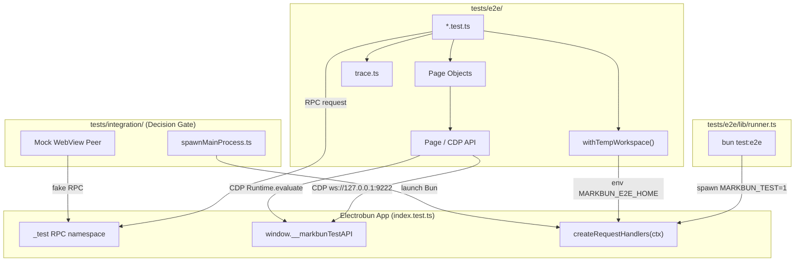

# feat: E2E Testing System for MarkBun

## Overview

为 MarkBun 构建一套统一的端到端测试体系，包含自动化 runner、类型化的 CDP Page API、Page Object 库、`_test` RPC 内部控制面、零配置隔离 fixture、失败自动取证、Integration 测试层（Mock WebView Peer），以及项目级 Skill。体系目标是为即将到来的大规模重构提供安全网，确保跨进程边界行为（菜单分发、文件保存、设置持久化、AI 流、会话恢复）在重构后仍然正确。

## Problem Frame

MarkBun 的系统复杂度持续增长，即将进入重构期。现有 `tests/unit/` 只能验证纯服务逻辑，无法覆盖 Electrobun 主进程与 WebView 渲染进程之间的跨边界交互。历史最严重的 bug（macOS 菜单分发静默失败、启动时 session 被覆盖、文件切换后内容丢失、AI 流生命周期竞态）都发生在这些边界上。现有的 `.claude/skills/self-test/` 仅支持 AI 手动验证，不能作为自动化回归测试。

我们需要一个可自动化运行、可本地快速执行、结果稳定、失败时可定位的 E2E 测试体系（参见 origin: [docs/brainstorms/2026-04-12-e2e-testing-system-requirements.md](docs/brainstorms/2026-04-12-e2e-testing-system-requirements.md)）。

## Requirements Trace

- **R1** 单一命令入口 `bun test:e2e`，自动启停应用并等待 CDP 就绪 → Unit 2a
- **R2** Runner 支持按文件/标签过滤 → Unit 2a
- **R3** 每次运行使用独立的 Electrobun 实例 → Unit 2a + Unit 4
- **R4-R6** 类型化 CDP Page API 与 Page Object 库 → Unit 2b + Unit 6
- **R7-R9** `_test` RPC 命名空间与 `window.__markbunTestAPI` → Unit 3
- **R10-R12** 零配置隔离工作区 fixture → Unit 1b + Unit 4
- **R13-R15** 分层测试架构（`tests/e2e/` + `tests/integration/`）→ Decision Gate (Phase 4)
- **R16-R17** 失败自动取证 → Unit 5
- **R18-R19** 项目级 Skill「创建端到端测试」→ Unit 8

## Scope Boundaries

- **非目标**：覆盖所有历史 bug 的回归测试（属于内容填充，不在基础设施范围）。
- **非目标**：视觉回归 / 像素级 diff（baseline 管理成本高，待基础设施稳定后再评估）。
- **非目标**：Windows CI 上的完整 E2E 运行（优先 macOS 本地及 CI；Windows 先保证集成测试层可跑）。
- **非目标**：修改 Electrobun 框架本身（所有实现基于现有 v1.16.0 API）。

### Deferred to Separate Tasks

- **集成测试层 Mock WebView Peer**：若 Phase 1-3 进展顺利，进入 Phase 4 Decision Gate 进行可行性 spike；若实现成本过高，整层可延后或放弃，由 E2E 层覆盖关键边界（见 origin D5）。

## Context & Research

### Relevant Code and Patterns

- `src/bun/index.ts` — 主进程入口。已有 `if (import.meta.main)` 保护，但末尾的 `main().catch(console.error)` 与大量闭包状态使得测试入口复用困难。
- `src/bun/index.test.ts` — 现有原型测试入口，是 `index.ts` 的完整副本（~2400 行），仅添加了两个 `_test*` RPC 并移除了 `import.meta.main` 保护。此副本不可维护，必须重构为共享逻辑。
- `.claude/skills/self-test/scripts/cdp.ts` — 底层 CDP 脚本，已验证 WebSocket 连接 `ws://127.0.0.1:9222`、截图、eval、click-sel、type、wait-for 能力。
- `spikes/e2e/test-runner-v5.ts` — 已验证：`bun run dev:hmr` 启动后 CDP 页面约 10s 内出现（上限 90s）；`detached: true` + `process.kill(-pid, 'SIGTERM')` → `SIGKILL` 的 teardown 链可清理 zombie 进程。
- `spikes/e2e/test-homedir.ts` / `test-homedir-child.ts` — 已验证：**仅靠 `HOME` 环境变量无法重定向子进程中的 `os.homedir()`**；必须在目标进程内部通过运行时拦截（`mock.module('os')` 或包装模块）才能生效。
- `tests/unit/bun/services/backup.test.ts` — 展示了 `mock.module('os')` + 动态 `import` 的隔离模式。
- `src/shared/types.ts` — `MarkBunRPC` 是 RPC 契约的唯一可信来源；新增 `_test` 请求必须扩展此类型。
- `src/mainview/lib/electrobun.ts` — 渲染进程 RPC 客户端包装模式；`__markbunTestAPI` 应遵循同一文件附近的挂载模式。

### Institutional Learnings

- **macOS 菜单分发双路径 bug**（`docs/solutions/ui-bugs/macos-menu-action-dispatch-bug-2026-04-03.md`）：任何菜单行为都必须在 `ApplicationMenu.on('application-menu-clicked')` 和 `sendMenuAction` RPC 中同时存在。测试体系必须把菜单分发作为核心验证目标。
- **AI 流生命周期与 RPC 边界**（`docs/solutions/integration-issues/ai-tool-call-cascading-failures-rpc-stream-lifecycle-2026-04-04.md`）：Electrobun 没有 `evaluateJavascriptWithResponse`，Bun→WebView 带返回值必须走 `webview.rpc.request`。`_test` RPC 的设计与此约束完全一致。
- **Session Persistence Race**（`docs/solutions/logic-errors/session-persistence-race-condition-react-effect-2026-04-02.md`）：E2E 必须验证「关闭时带有打开文件 → 重启后恢复该文件」，并验证 `session-state.json` 不会被空状态覆盖。
- **Editor Content Lost on File Switch**（`docs/solutions/logic-errors/editor-content-lost-on-file-switch-2026-04-04.md`）：Programmatic `setMarkdown` 不会同步触发 React state；E2E 断言前必须轮询编辑器就绪状态，不能假设同步更新。

### External References

无。Electrobun v1.16.0 生态较新，本地 spikes 和模式已足够指导实现；外部文档提供的额外价值有限。

## Key Technical Decisions

1. **提取 RPC Handler Factory 代替复制 `index.test.ts`**  
   现有 `src/bun/index.test.ts` 是 `index.ts` 的 2400 行副本，任何主进程逻辑变更都需要两处同步，维护成本不可接受。然而，`main()` 不是一个简单的函数：它包含模块级可变状态（`focusedWindow`、`activeAIContext`、`viewMenuState` 等）、嵌套的 `createAppWindow()`、全局事件注册和进程级副作用。将整个 `main()` 提取为 `createApp()` 会创造一个边界不清、风险过高的「万能」抽象。
   
   **决策：仅提取 RPC handler 工厂。** 在 `src/bun/app.ts` 中导出 `createRequestHandlers(ctx: AppContext)`，它返回 `MarkBunRPC['bun']['requests']` 对象。`ctx` 是一个可变的 plain context 对象，通过 getter/setter 或引用传递让 handler 能够操作原本闭包捕获的模块状态。`index.ts` 中的 `main()` 继续作为生产编排器，在 `createAppWindow()` 内部调用 `createRequestHandlers(ctx)`。`index.test.ts` 则导入同一个工厂，构建相同的 `ctx`，然后通过对象展开 `...createRequestHandlers(ctx)` 注入 `_test*` handler。这样消除了 2400 行复制粘贴，同时最大程度上保持生产启动路径不变。参见 deepening 阶段 architecture-strategist 与 repo-research-analyst 的分析。

2. **`homedir()` 重定向使用包装模块而非环境变量**  
   Spike 已证明 `HOME` 环境变量无法可靠重定向 Bun 子进程中的 `os.homedir()`。计划将所有 `src/bun/` 中的 `import { homedir } from 'os'` 替换为 `import { homedir } from './services/homedir'`。包装模块优先读取 `process.env.MARKBUN_E2E_HOME`，未设置时回退到 `os.homedir()`。这保证了 E2E runner 可以通过单一环境变量实现零侵入的完整文件系统隔离。

3. **`_test` RPC 类型化并加入 `MarkBunRPC`**  
   现有原型 `_testMenuAction` / `_testGetEditorMarkdown` 是绕过类型的动态字段。计划将它们正式加入 `src/shared/types.ts` 的 `MarkBunRPC.bun.requests`，确保 TypeScript 在前端、主进程、测试代码中三端同步。

4. **CDP API 作为库复用而非 shell 调用**  
   `.claude/skills/self-test/scripts/cdp.ts` 的 WebSocket/CDP 逻辑将被提取为 `tests/e2e/lib/page.ts` 中的 `Page` 类。测试代码不再通过 `bun $CDP ...` 子进程调用，而是直接复用持久化的 CDP WebSocket 会话，显著降低延迟并保留页面状态。

5. **Integration 层为有条件交付**  
   Mock WebView Peer 的可行性尚未完全验证。计划在 Phase 1-2（基础设施 + 第一条 E2E 黄金路径）完成后，以 spike 评估 Mock Peer 成本；若超出预期，允许推迟或取消，由 E2E 层承担边界验证。

## Open Questions

### Resolved During Planning

- **`index.ts` 模块级 `main()` 调用是否阻塞测试入口？**  
  已确认 `src/bun/index.ts:2463` 已有 `if (import.meta.main)` 保护，且 `src/bun/index.test.ts` 原型已验证复用可行。真正的问题是「复制粘贴」不可维护。经过 deepening 评估，决定不提取庞大的 `main()`，而是提取更低风险、更精确的 RPC handler 工厂 `createRequestHandlers(ctx)`，由 `index.ts` 和 `index.test.ts` 共享。

### Deferred to Implementation

- **Runner 在 macOS 上 `SIGTERM` vs `SIGKILL` 的最优清理顺序：** `test-runner-v5.ts` 已验证基本可行，但大规模测试运行下的 zombie 率需要在实现阶段实测后微调超时参数。
- **哪些 Milkdown 操作最应该放入 `__markbunTestAPI` 而非 CDP 模拟：** 在第一条 E2E 测试编写过程中根据 flakiness 经验决定平衡点。
- **Mock WebView Peer 最小可行实现：** 需要实际 spike 后才能确定是 stub `electrobun/bun` 模块还是 IPC 模拟更合适。

## Output Structure

```
tests/
├── unit/                           # 现有单元测试
├── integration/                    # Mock WebView 集成测试（可选延后）
│   ├── helpers/
│   │   ├── mockWebView.ts
│   │   └── spawnMainProcess.ts
│   ├── menu-dispatch.test.ts
│   ├── file-save.test.ts
│   ├── settings-persist.test.ts
│   └── session-restore.test.ts
├── e2e/                            # CDP 驱动真实 WebView
│   ├── __traces__/                 # 失败取证（gitignored）
│   ├── fixtures/                   # seed 文件
│   ├── lib/
│   │   ├── runner.ts               # 生命周期管理
│   │   ├── page.ts                 # Playwright-like CDP API
│   │   ├── page-objects/
│   │   │   ├── EditorPage.ts
│   │   │   ├── DialogPage.ts
│   │   │   ├── SettingsPage.ts
│   │   │   └── QuickOpenPage.ts
│   │   ├── withTempWorkspace.ts    # 隔离 fixture
│   │   └── trace.ts                # 失败取证收集
│   ├── file-lifecycle.test.ts
│   ├── export-image.test.ts
│   ├── ai-chat.test.ts
│   └── settings-ui.test.ts
├── e2e-setup.ts                    # 全局 beforeAll / afterAll
src/
├── bun/
│   ├── app.ts                      # createRequestHandlers(ctx) 工厂
│   ├── index.ts                    # 生产入口编排器（保留 main()）
│   ├── index.test.ts               # 测试入口（导入工厂 + 注入 _test RPC）
│   └── services/
│       └── homedir.ts              # MARKBUN_E2E_HOME 包装模块
├── shared/
│   └── types.ts                    # MarkBunRPC 扩展 _test 请求
└── mainview/
    └── lib/
        └── test-api.ts             # window.__markbunTestAPI 挂载
.claude/skills/e2e-test/
├── SKILL.md
└── templates/
```

## High-Level Technical Design

> *This illustrates the intended approach and is directional guidance for review, not implementation specification. The implementing agent should treat it as context, not code to reproduce.*



## Implementation Units

### Phase 1: 基础设施底座（Week 1，可并行）

- [ ] **Unit 1a: Extract `createRequestHandlers(ctx)` + Refactor Test Entry**

**Goal:** 以最低风险消除 `index.ts` / `index.test.ts` 的 2400 行复制粘贴，而不把庞大的 `main()` 提取为不清不楚的万能抽象。

**Requirements:** R7-R9（测试控制面的基础）

**Dependencies:** None

**Files:**
- Create: `src/bun/app.ts`
- Modify: `src/bun/index.ts`, `src/bun/index.test.ts`

**Approach:**
1. 在 `src/bun/app.ts` 中导出 `createRequestHandlers(ctx: AppContext)`，返回 `MarkBunRPC['bun']['requests']`。
2. `ctx` 是一个 plain mutable context 对象，包含 `state`、`focusedWindow`（通过 getter/setter 或 mutable wrapper）、`activeAIContext`、`currentSettings`、`currentUIState`、`currentSessionState`、`viewMenuState`、pending paths、以及 `createAppWindow` / `updateViewMenuState` 回调。
3. 将 `src/bun/index.ts` 中 `createAppWindow()` 内部的 `handlers.requests` 和 `handlers.messages` 对象替换为对 `createRequestHandlers(ctx)` 的调用。
4. `index.ts` 继续保留 `main()` 作为生产编排器（加载设置、初始化 i18n、注册全局事件、创建窗口），仅在底部保留 `if (import.meta.main) { main().catch(...) }`。
5. `index.test.ts` 重写为薄包装：
   - 导入 `createRequestHandlers` 和必要的模块状态初始化逻辑
   - 构建与生产一致的 `ctx`
   - 在 `BrowserView.defineRPC` 中使用 `requests: { ...createRequestHandlers(ctx), _testMenuAction: ..., _testGetEditorMarkdown: ... }`
   - 这样 `index.test.ts` 的行数从 ~2400 降到 ~200 行以内。

**Patterns to follow:**
- `src/bun/services/ai-stream.ts` 中 `createDefaultToolExecutor(executeToolRPC)` 的工厂闭包模式。
- `src/bun/menu.ts` 的纯函数-over-plain-data 风格。

**Test scenarios:**
- **Happy path:** `bun src/bun/index.test.ts` 能正常启动应用，且 `_testMenuAction` RPC 可调用。
- **Integration:** `tests/unit/bun/app/createRequestHandlers.test.ts`（新增）验证返回的对象包含 `openFile`、`saveFile`、`getSettings`、`aiChat`、`sendMenuAction` 等关键 key。
- **Edge case:** 生产入口 `index.ts` 的 `if (import.meta.main)` 仍然有效，`spikes/e2e/test-import.ts` 式的 `import '../../src/bun/index.ts'` 不会意外启动应用。

**Verification:**
- `src/bun/index.test.ts` 行数 < 200 行。
- `bun run dev:hmr`（即 `bun src/bun/index.ts`）手动启动成功，File → Open、File → Save、View → Toggle Sidebar 行为正常。
- `bun test tests/unit/bun/app/createRequestHandlers.test.ts` 通过。

---

- [ ] **Unit 1b: `homedir` Wrapper + Mechanical Replacement**

**Goal:** 建立可靠的全局路径隔离机制，使 E2E runner 能通过单一环境变量重定向所有配置/备份/恢复路径。

**Requirements:** R10-R12（隔离基础）

**Dependencies:** None（可与 1a 并行）

**Files:**
- Create: `src/bun/services/homedir.ts`
- Modify: 所有在 `src/bun/**` 中 `import { homedir } from 'os'` 的文件（约 15 个，包括 `index.ts`、`index.test.ts`、settings、uiState、sessionState、backup、ai-keys、ai-sessions、recentFiles、commandHistory、ipc 文件等）

**Approach:**
1. 创建 `src/bun/services/homedir.ts`：
   ```ts
   import { homedir as osHomedir } from 'os';
   export function homedir(): string {
     return process.env.MARKBUN_E2E_HOME || osHomedir();
   }
   ```
2. 批量替换 `src/bun/` 中所有 `import { homedir } from 'os'` 为 `import { homedir } from './services/homedir'`。

**Patterns to follow:**
- `tests/unit/bun/services/backup.test.ts` 的 `TEST_HOME` 路径构造模式。

**Test scenarios:**
- **Happy path:** 设置 `MARKBUN_E2E_HOME=/tmp/xxx` 后启动应用，保存设置，文件出现在 `/tmp/xxx/.config/markbun/settings.json`。
- **Integration:** `tests/unit/bun/services/homedir.test.ts`（新增）断言 `MARKBUN_E2E_HOME` 存在时返回该路径，否则回退到 `os.homedir()`。
- **Edge case:** `MARKBUN_E2E_HOME` 未设置时，包装模块返回真实 `os.homedir()`。
- **Error path:** `MARKBUN_E2E_HOME` 指向不存在的路径时，`mkdir({ recursive: true })` 应自动创建，不影响服务启动。

**Verification:**
- `bun test tests/unit/bun/services/homedir.test.ts` 通过。
- 运行 `MARKBUN_E2E_HOME=/tmp/markbun-e2e-check bun src/bun/index.test.ts` 后，`/tmp/markbun-e2e-check/.config/markbun/settings.json` 存在。
- 真实 `~/.config/markbun/` 未被修改。

---

- [ ] **Unit 2a: E2E Runner (`tests/e2e/lib/runner.ts`)**

**Goal:** 提供 `bun test:e2e` 单一命令入口，负责应用生命周期管理和安全 teardown。

**Requirements:** R1, R2, R3

**Dependencies:** None（可与 1a/1b/2b 并行）

**Files:**
- Create: `tests/e2e/lib/runner.ts`, `tests/e2e-setup.ts`
- Modify: `package.json`

**Approach:**
1. `runner.ts` 封装生命周期：
   - `spawn('bun', ['run', 'dev:hmr'], { detached: true, env: { ...process.env, MARKBUN_TEST: '1', MARKBUN_E2E_HOME: tempDir } })`
   - 轮询 `http://127.0.0.1:9222/json`，超时 90s。
   - 使用 `bun test` 内置 runner 执行测试文件。
   - teardown：先 `SIGTERM` 进程组，3s 后若存活则 `SIGKILL`；随后检查 `pgrep` 中残留的 `electrobun` / `CEF`，若存在则追加清理。
2. `tests/e2e-setup.ts` 提供全局 `beforeAll`/`afterAll`（如 runner 采用 `bun test` 直接驱动测试文件）。
3. `package.json` 添加 `"test:e2e": "bun tests/e2e/lib/runner.ts"`。

**Patterns to follow:**
- `spikes/e2e/test-runner-v5.ts` 的启停逻辑和 zombie 检测。

**Test scenarios:**
- **Happy path:** `bun test:e2e` 能在 120s 内完成「启动 → CDP 就绪 → 执行最小 no-op 测试 → teardown」全生命周期。
- **Error path:** 当 CDP 端口在 90s 内未就绪时，runner 强制 kill 进程并返回非零退出码。
- **Edge case:** 连续运行两次 `bun test:e2e`，通过 `pgrep` 确认无 zombie `electrobun` / `CEF` 进程泄漏。

**Verification:**
- `tests/e2e/lib/runner.health.test.ts`（新增）调用 runner 执行一条 no-op 测试，验证启动、CDP 响应、teardown、无泄漏。
- `bun test:e2e` 成功运行并正常退出。

---

- [ ] **Unit 2b: CDP Page API (`tests/e2e/lib/page.ts`)**

**Goal:** 将现有 CDP 脚本能力封装为类型化的 `Page` 类库，供测试代码直接复用。

**Requirements:** R4

**Dependencies:** None（可与 2a 并行）

**Files:**
- Create: `tests/e2e/lib/page.ts`

**Approach:**
`page.ts` 提取 `.claude/skills/self-test/scripts/cdp.ts` 的 WebSocket/CDP 会话逻辑为 `Page` 类：
- `connect()`, `close()`
- `evaluate<T>(fn)` / `evaluateJSON<T>(expr)`
- `click(selector)`, `type(selector, text)`, `key(name)`
- `waitForSelector(selector, { timeout, interval })`
- `screenshot(path): Promise<Buffer>`

**Patterns to follow:**
- `.claude/skills/self-test/scripts/cdp.ts` 的 pending-promise map 和 command timeout。
- SKILL.md 中的 zsh 警告：避免 `!!`，使用 `Boolean(...)`。

**Test scenarios:**
- **Happy path:** `page.evaluate(() => document.title)` 返回 `"MarkBun"`。
- **Integration:** `page.screenshot('/tmp/runner-check.png')` 返回有效 PNG 文件头（通过 Buffer 前几个字节断言）。
- **Error path:** `waitForSelector('.not-exist', { timeout: 100 })` 在超时后抛出明确错误。

**Verification:**
- TypeScript 编译通过，`Page` 类的所有 public 方法均有类型签名。
- 一条最小测试成功通过 `Page` 连接 CDP 并截图。

---

- [ ] **Unit 3: `_test` RPC Namespace + `window.__markbunTestAPI`**

**Goal:** 建立测试专用的内部控制面，让无法通过 CDP 操作的原生菜单功能和复杂 DOM 状态可被稳定触达和断言。

**Requirements:** R7, R8, R9

**Dependencies:** Unit 1a

**Files:**
- Modify: `src/shared/types.ts`
- Modify: `src/bun/index.test.ts`
- Create: `src/mainview/lib/test-api.ts`
- Modify: `src/mainview/main.tsx` 或 `App.tsx`

**Approach:**
1. 在 `src/shared/types.ts` 的 `MarkBunRPC.bun.requests` 中新增类型化的 `_test` 请求：
   - `_testMenuAction`: 触发菜单行为
   - `_testGetEditorMarkdown` / `_testSetEditorMarkdown`: 读写编辑器内容
   - `_testInjectSettings` / `_testResetSettings`: 快速注入/重置设置
   - `_testClearRecovery` / `_testSimulateCrash`: 备份/恢复控制
2. 在 `src/bun/index.test.ts` 的请求对象中通过展开 `...createRequestHandlers(ctx)` 后追加这些 handler。每个 handler 增加运行时门禁：`if (process.env.MARKBUN_TEST !== '1') return { success: false, error: 'Forbidden' }`。
3. 渲染进程在 `src/mainview/lib/test-api.ts` 中创建 `window.__markbunTestAPI` 对象（仅在 `import.meta.env.DEV` 下挂载）， expose `isEditorReady()`、`getEditorMarkdown()`、`setEditorMarkdown(text)`、`menuAction(action)`，直接操作 editor 实例和 RPC 客户端。

**Patterns to follow:**
- 现有 `src/mainview/lib/electrobun.ts` 的 RPC 请求封装模式。
- AI streaming 机构知识：带返回值的操作必须通过 `webview.rpc.request`。

**Test scenarios:**
- **Happy path:** CDP `evaluate` 调用 `window.__markbunTestAPI.menuAction('toggle-ai-panel')` 后，AI 面板 DOM 出现。
- **Happy path:** `_testGetEditorMarkdown` 返回当前 Markdown。
- **Security:** `src/bun/index.ts` 中不存在任何 `_test` handler；`_test` handler 在 `MARKBUN_TEST=0` 时返回 `Forbidden`。
- **Error path:** `_testMenuAction` 在窗口未聚焦时返回 "No focused window"。

**Verification:**
- TypeScript 编译通过，`_test` RPC 类型在三端同步。
- 最小测试成功通过 `_testMenuAction` 触发菜单行为并断言 DOM 变化。

---

- [ ] **Unit 4: Zero-Config Fixture (`withTempWorkspace`)**

**Goal:** 为每个测试提供完全隔离的文件系统和配置目录，测试结束后自动清理。

**Requirements:** R10, R11, R12

**Dependencies:** Unit 1b

**Files:**
- Create: `tests/e2e/lib/withTempWorkspace.ts`

**Approach:**
1. 每次调用生成唯一目录：`join(tmpdir(), 'markbun-e2e', `${process.pid}-${Date.now()}-${randomBytes(4).toString('hex')}`)`。
2. 返回 `{ filesDir, configDir, seed(files), cleanup() }`。
3. `runner.ts` 在启动 Electrobun 子进程前，将该目录注入到 `env.MARKBUN_E2E_HOME`。
4. `cleanup()` 执行 `rmSync(dir, { recursive: true, force: true })`，失败时仅 warn 不抛错。
5. 提供 `seed()` 辅助，支持从 `tests/e2e/fixtures/` 复制预置资源。

**Patterns to follow:**
- `tests/unit/bun/services/backup.test.ts` 的 `TEST_HOME` 路径构造模式。

**Test scenarios:**
- **Happy path:** `withTempWorkspace({ seed: ['sample.md'] })` 创建目录并复制 seed 文件。
- **Integration:** fixture 作用域内保存设置，assert 设置 JSON 仅出现在 fixture 的 `configDir` 下。
- **Edge case:** 快速连续调用两次得到两个不同目录路径。
- **Error path:** `rmSync` 失败时不会掩盖测试失败的主报告。

**Verification:**
- 运行一个使用 fixture 的测试后，真实 `~/.config/markbun` 未被修改。

### Phase 2: 第一条黄金路径测试 + 失败取证（Week 1-2）

- [ ] **Unit 5: First Golden Path E2E Test + Auto-Trace**

**Goal:** 验证整套基础设施能否跑通一个真实用户旅程，并确保测试失败时有足够的上下文定位问题。

**Requirements:** R5, R16, R17

**Dependencies:** Units 1a, 1b, 2a, 2b, 3, 4

**Files:**
- Create: `tests/e2e/file-lifecycle.test.ts`, `tests/e2e/lib/trace.ts`
- Modify: `.gitignore`（添加 `tests/e2e/__traces__/`）

**Approach:**
1. `file-lifecycle.test.ts` 实现旅程：启动 → 输入 `# Hello MarkBun` → `file-save` → 关闭 → 重启并打开同一文件 → 断言内容一致。
2. `trace.ts` 在测试失败时收集：截图、DOM 快照、Bun 主进程 stdout/stderr 最后 50 行、CDP 命令轨迹、工作区文件树快照，写入 `tests/e2e/__traces__/${testName}-${timestamp}/`。
3. 在 `afterEach` 中集成自动取证。

**Execution note:** 先写一条预期失败的断言，验证 trace 收集完整，再修正断言使其通过。

**Patterns to follow:**
- SKILL.md 稳定选择器：`.milkdown`、`.ProseMirror`、`[role="dialog"]`。
- 机构知识：断言前必须轮询 `__markbunTestAPI.isEditorReady()`。

**Test scenarios:**
- **Happy path:** `file-lifecycle.test.ts` 完整通过。
- **Error path:** 故意写入错误断言，验证 `__traces__/` 目录包含截图、DOM 快照、日志。
- **Integration:** Trace 目录路径在失败报告中可读取。
- **Edge case:** 多个失败测试生成独立带时间戳目录，无覆盖。

**Verification:**
- `bun test:e2e`（过滤执行 `file-lifecycle`）成功通过。
- 手动破坏断言后 rerun，确认 `__traces__/` 目录非空且内容完整。

### Phase 3: Page Object 与测试扩展（Week 2）

- [ ] **Unit 6: Page Objects + Extended Core Tests**

**Goal:** 将裸 CDP 操作和选择器知识沉淀为可复用的 Page Object，并建立 4-5 条核心场景测试。

**Requirements:** R5, R6

**Dependencies:** Unit 5

**Files:**
- Create: `tests/e2e/lib/page-objects/EditorPage.ts`, `DialogPage.ts`, `SettingsPage.ts`, `QuickOpenPage.ts`
- Create: `tests/e2e/export-image.test.ts`, `tests/e2e/settings-ui.test.ts`, `tests/e2e/ai-chat.test.ts`, `tests/e2e/menu-dispatch.test.ts`

**Approach:**
1. `EditorPage`: `waitForReady()`, `typeMarkdown(text)`, `getMarkdown()`, `save()`。
2. `DialogPage`: `waitForDialog()`, `closeDialog()`, `getDialogText()`。
3. `SettingsPage`: `open()`, `toggle(name)`, `setFontSize(n)`。
4. `QuickOpenPage`: `open()`, `typeQuery(q)`, `selectResult(n)`。
5. 新增 4 条扩展测试：导出 PNG、设置持久化、AI 对话、菜单分发双路径验证。

**Test scenarios:**
- **Happy path:** `EditorPage.typeMarkdown('# Title')` 后 `getMarkdown()` 返回相同内容。
- **Happy path:** `settings-ui.test.ts` 中切换 `autoSave`，assert 设置 JSON 持久化且 UI checkbox 同步。
- **Happy path:** `export-image.test.ts` 触发导出 PNG，assert 文件大小 > 0。
- **Happy path:** `ai-chat.test.ts` 发送 AI 消息，assert 流式响应出现在 AI 面板。
- **Integration:** `menu-dispatch.test.ts` 验证同一菜单行为在 macOS 路径（`ApplicationMenu.on`）和 Windows RPC 路径下产生相同的 renderer 事件。
- **Edge case:** 当 Milkdown 尚未初始化时，`EditorPage.waitForReady()` 在超时前持续轮询。

**Verification:**
- 手动修改一个 DOM class，仅修改对应 Page Object 一处，所有测试仍然通过。
- 核心场景测试（共 4-5 条）全部通过。

### Phase 4: Decision Gate — Mock WebView Peer 可行性（Week 3，可选）

> **这不是一个常规的 Implementation Unit，而是一个有条件的决策门。**

- [ ] **Decision Gate: Mock WebView Peer Feasibility**

**Goal:** 在投入大量工程时间之前，验证 Integration 测试层（Mock WebView Peer）是否可在 Bun 测试环境中实现。

**Trigger:** Phase 3（Unit 6）稳定后，至少 3 条核心 E2E 测试已稳定通过。

**Activity (max 2 days):**
1. 在 `tests/integration/helpers/mockWebView.ts` 中尝试 stub 或替换 `electrobun/bun` 的 `BrowserView.defineRPC`，使其在不加载真实 CEF/WebView 的情况下接收并记录 RPC 调用。
2. 在 `tests/integration/helpers/spawnMainProcess.ts` 中尝试以 `src/bun/index.test.ts` 为入口启动主进程，但不启动渲染层。
3. 运行一条最小集成测试（例如 `menu-dispatch`），验证能否在无 GUI 环境下断言 RPC 事件。

**Outcomes:**
- **GO:** 进入 Integration 层实施，创建 `tests/integration/menu-dispatch.test.ts`、`file-save.test.ts`、`settings-persist.test.ts`、`session-restore.test.ts`，目标是在 SSH session 中 `bun test tests/integration/` 通过且单条 < 2s。
- **NO-GO:** 记录 blocker（如 `electrobun/bun` 模块在 import 时触发不可 stub 的副作用、或 `BrowserWindow` 构造函数强制加载原生库），archive spike 代码，明确由 E2E 层覆盖所有关键边界。关闭 Phase 4，直接进入 Phase 5。

### Phase 5: Skill 封装（Week 3-4）

- [ ] **Unit 8: Project Skill `.claude/skills/e2e-test/`**

**Goal:** 让团队可以通过自然语言指令生成符合项目最佳实践的 E2E 测试代码。

**Requirements:** R18, R19

**Dependencies:** Units 5-6

**Files:**
- Create: `.claude/skills/e2e-test/SKILL.md`, `.claude/skills/e2e-test/templates/test-file-template.ts`, `.claude/skills/e2e-test/templates/test-ai-chat-template.ts`, `.claude/skills/e2e-test/templates/test-settings-template.ts`

**Approach:**
1. `SKILL.md` 明确声明这是「E2E 测试生成器」，应指导使用者：
   - 何时使用 `withTempWorkspace`
   - 何时使用 `EditorPage` / `SettingsPage` / `DialogPage`
   - 如何通过 `_testMenuAction` 触发不可 CDP 点击的菜单
   - 编辑器断言前必须 `waitForReady`
2. 提供 3-4 个代码模板，覆盖文件操作、设置切换、AI 对话、导出。
3. Skill 示例 prompt：「给文件保存功能加一个 E2E 测试」→ 输出可直接放入 `tests/e2e/xxx.test.ts` 的代码。

**Patterns to follow:**
- `.claude/skills/self-test/SKILL.md` 的格式和语气。

**Test scenarios:**
- **Happy path:** 使用 Skill 生成「验证主题切换」的 E2E 测试，代码可直接编译并运行通过。
- **Happy path:** 使用 Skill 生成「AI 对话」测试，代码正确使用了 `withTempWorkspace`、`_testMenuAction` 和 `EditorPage`。
- **Integration:** Skill 输出中不包含已被废弃的 `.self-test/scripts/cdp.ts` 裸 shell 调用方式。

**Verification:**
- 将 Skill 生成的 2-3 个测试文件放入 `tests/e2e/` 后，`bun test:e2e` 能成功运行并通过。

## System-Wide Impact

- **Interaction graph:**
  - `MarkBunRPC` 类型新增 `_test*` 请求，影响 `src/bun/index.test.ts` 和 `src/mainview/lib/electrobun.ts` 的编译时检查。
  - `src/bun/services/homedir.ts` 的引入会触碰约 9 个服务文件（settings、uiState、sessionState、backup、ai-keys、ai-sessions、recentFiles、commandHistory、index.ts）。
  - `package.json` 新增 `test:e2e` 脚本，CI pipeline 若扩展可直接复用。
- **Error propagation:**
  - `runner.ts` 的失败（启动超时、teardown 泄漏）不会破坏用户数据，因为它运行在隔离的 `MARKBUN_E2E_HOME` 下。
  - `_test` RPC 的硬拒绝逻辑（`MARKBUN_TEST !== '1'`）确保生产环境即使意外包含测试入口也不会暴露控制面。
- **State lifecycle risks:**
  - `withTempWorkspace` 的 `cleanup()` 在 `afterEach` 中运行。如果应用 teardown 失败导致子进程残留，可能持有临时目录文件句柄，导致 `rmSync` 部分失败。应在 `cleanup` 中用 try/catch 并仅打印警告，不阻塞主测试失败报告。
  - E2E 测试中的 `saveSettings` / `saveUIState` 会写盘到 fixture 目录，但因为所有路径都经过 `homedir` 包装模块，不会串味到真实 home。
- **API surface parity:**
  - `src/shared/types.ts` 的 `_test` RPC 扩展需要与 `src/mainview/lib/electrobun.ts` 中的请求方法保持同步（若前端也需要请求 `_test` RPC）。
- **Integration coverage:**
  - CDP `Page.captureScreenshot` 依赖于真实 CEF/WebView 的渲染状态，runner 的测试通过本身即验证了 Electrobun 的启动路径。
  - `_testMenuAction` 必须同时验证 macOS 路径（`ApplicationMenu.on`）和 Windows 路径（`sendMenuAction`）的一致性；Unit 7 的 integration 测试或 Unit 5-6 的 E2E 测试需覆盖此点。
- **Unchanged invariants:**
  - 生产构建脚本 `build:canary` / `build:stable` 继续使用 `src/bun/index.ts`，完全不会接触 `index.test.ts`、`_test` RPC 或 `homedir` 测试路径。
  - 现有 `tests/unit/` 的结构和运行方式保持不变；`bun test` 仍然是纯单元测试命令。

## Risks & Dependencies

| Risk | Likelihood | Impact | Mitigation |
|------|-----------|--------|------------|
| **createApp() 提取过程中破坏正常启动路径** | 中 | 高 | 提取后立刻用 `bun run dev:hmr` 手动验证应用能正常启动；保持 `index.ts` 的入口合约不变。 |
| **zombie CEF/WebView 进程泄漏** | 中 | 中 | `runner.ts` 继承 `test-runner-v5.ts` 的 `SIGTERM`→`SIGKILL` 进程组 kill 链 + `pgrep` 检测；实现阶段实测 zombie 率。 |
| **`_test` RPC 意外进入生产构建** | 低 | 高 | 构建脚本严格使用 `src/bun/index.ts`；每个 `_test` handler 内部硬检查 `MARKBUN_TEST === '1'`。 |
| **CDP 连接 flaky（时序不稳定）** | 中 | 中 | `Page` API 内置指数退避重试；`waitForSelector` 采用轮询而非固定 sleep；关键断言前检查 `document.readyState`。 |
| **Mock WebView Peer 实现成本过高** | 中 | 低 | 明确列为可选交付项；若 spike 失败，直接放弃集成测试层，由 E2E 层覆盖关键边界。 |
| **Tailwind 类名重构导致 E2E 选择器失效** | 中 | 低 | Page Object 集中管理选择器；测试代码禁止直接使用 Tailwind 原子类。 |

## Phased Delivery

### Phase 1: 基础设施底座（Week 1）
- Unit 1: Extract `createApp()` + `homedir` wrapper
- Unit 2: E2E Runner + CDP Page API
- Unit 3: `_test` RPC namespace + `__markbunTestAPI`
- Unit 4: Zero-Config Fixture

### Phase 2: 第一条黄金路径测试 + 取证（Week 1-2）
- Unit 5: `file-lifecycle.test.ts` + `trace.ts`

### Phase 3: Page Object 与测试扩展（Week 2）
- Unit 6: Page Objects + 3-5 条核心场景测试

### Phase 4: 集成测试层（Week 3，可选）
- Unit 7: Mock WebView Peer + Integration tests

### Phase 5: Skill 封装（Week 3-4）
- Unit 8: `.claude/skills/e2e-test/`

## Documentation / Operational Notes

- `package.json` 的 `scripts` 新增 `"test:e2e": "bun tests/e2e/lib/runner.ts"`。
- `.gitignore` 需添加 `tests/e2e/__traces__/`。
- `AGENTS.md`（或项目内部 onboarding 文档）应补充「如何新增一条 E2E 测试」的简短说明，指向 `file-lifecycle.test.ts` 作为最佳实践示例。
- CI 若未来集成 E2E，建议仅在 macOS runner 上运行 `bun test:e2e`，并设置超时 > 5 分钟（因为 `dev:hmr` 启动可能长达 90s）。

## Sources & References

- **Origin document:** [docs/brainstorms/2026-04-12-e2e-testing-system-requirements.md](docs/brainstorms/2026-04-12-e2e-testing-system-requirements.md)
- **Ideation document:** [docs/ideation/2026-04-12-e2e-testing-skill-ideation.md](docs/ideation/2026-04-12-e2e-testing-skill-ideation.md)
- **Related code:** `src/bun/index.ts`, `src/bun/index.test.ts`, `src/shared/types.ts`, `.claude/skills/self-test/scripts/cdp.ts`
- **Spikes:** `spikes/e2e/test-runner-v5.ts`, `spikes/e2e/test-homedir.ts`
- **Institutional learnings:**
  - `docs/solutions/ui-bugs/macos-menu-action-dispatch-bug-2026-04-03.md`
  - `docs/solutions/integration-issues/ai-tool-call-cascading-failures-rpc-stream-lifecycle-2026-04-04.md`
  - `docs/solutions/logic-errors/session-persistence-race-condition-react-effect-2026-04-02.md`
  - `docs/solutions/logic-errors/editor-content-lost-on-file-switch-2026-04-04.md`
